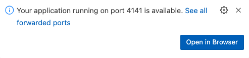

# TBD Workshop 2. Kedro
[Spaceflights tutorial](https://docs.kedro.org/en/stable/tutorial/spaceflights_tutorial.html)

## Workshop goals

1. Learn how to use Kedro for building reproducible, maintainable, and modular data pipelines.
2. Learn how to use PySpark (local mode and deployed on YARN) for data processing together with Kedro.
3. Learn how to use MLflow for tracking experiments and managing machine learning models.
4. Learn how to use Kedro-Viz for visualizing the data pipeline.
5. 

## Prerequisites
* TBD Workshop 1 infrastructure running - VertexAI Workbench Jupyter Lab accessed
* Run labs in the VSCode server available in your VertexAI Workbench Jupyter Lab


## Task 1. Setup Kedro project, run the pipeline locally 

1. Initialize Anaconda in terminal

```bash
conda init
```
Restart the bash session after running the above command.

2. Create Anaconda environment (Python 3.8 because of the compatibility with Python running on Dataproc cluster)

```bash 
conda create --name mlops-adac python=3.8 -y
```


3. Activate the conda environment

```bash
conda activate mlops-adac
```

4. Install Kedro

```bash
pip install kedro==0.19.3
```

5. Create a new Kedro project (we specify the starter template from the GitHub repository and the directory name from a specific branch)

```bash
kedro new --starter  https://github.com/mwiewior/kedro-starters/ --directory spaceflights-pyspark-mlflow --checkout spaceflights-pyspark-mlflow
```

Set the name for your new project: `adac-kedro-pyspark`

6. Change the directory to the newly created project

```bash
cd adac-kedro-pyspark
```

7. Configure required environment variables

```bash
# workaround for the issue with PySpark and threading for the local mode an logging MLflow runs
export PYSPARK_PIN_THREAD=false
```

8. Install the project dependencies

```bash
pip install -r requirements.txt
```

This step will last for ~10 minutes. Meanwhile, you can explore the kedro project structure and content, and continue with the next steps.
9. Run the MLflow

For running the Mlflow instance,

10. Run the Kedro pipeline

```bash
kedro run
```
11. Check experiment runs in MLflow
12. What Kedro environment is used by default? How to change it?

## Task 2. Run Kedro pipelines on a Dataproc cluster in a YARN-client mode

1. Create a new bucket in the same region as the rest of the infrastructure

```bash
# change the USER_ID to your username
export USER_ID=mwiewior
export MLOPS_ENV=gcp-dev
export DEV_BUCKET=gs://adac-mlops-${MLOPS_ENV}-${USER_ID}
gsutil mb -l europe-west1 $DEV_BUCKET
```
2. Copy the raw data to the newly created bucket

```bash
gsutil cp -r data/01_raw/* ${DEV_BUCKET}/data/01_raw/
```

3. Run the Kedro pipeline using `gcp-dev` (ensure that `DEV_BUCKET` environment variable is set correctly)

```bash
kedro run --env=gcp-dev
```
4. Check the experiment runs in MLflow and the UI of YARN

## Task 3. Visualize the Kedro pipeline
1. Run from the command line
```bash
kedro viz
```
2. After around 1 minute, you should see a pop-up window from VSCode prompting you allow port forwarding for port `4141`.
3. Click on the `Open Browser` button in the pop-up window.

Hint: there might another pop-up window from VSCode asking you to allow the port forwarding for port 4040 (Spar Application UI). 
4. To stop kedro viz press `Ctrl+C` in the terminal where you run the `kedro viz` command.


## Task 4. Create a new Kedro environment for the Dataproc cluster
TBD
## Task 5. Run inference on the Dataproc cluster
TBD