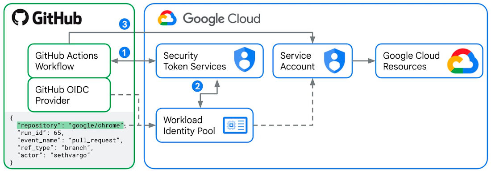
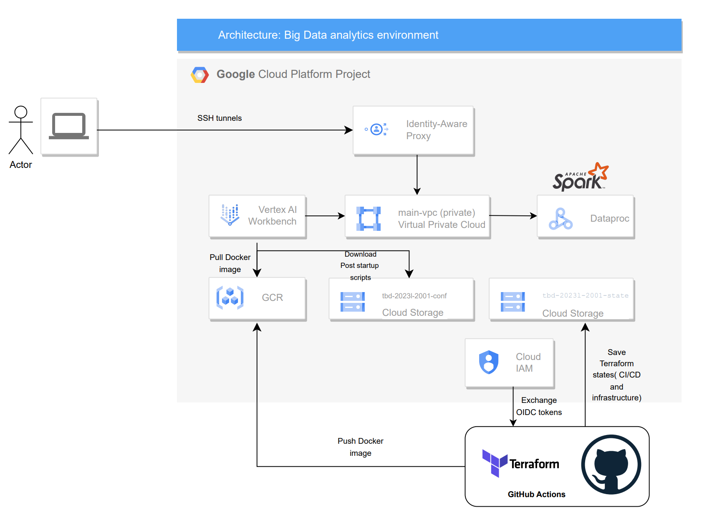
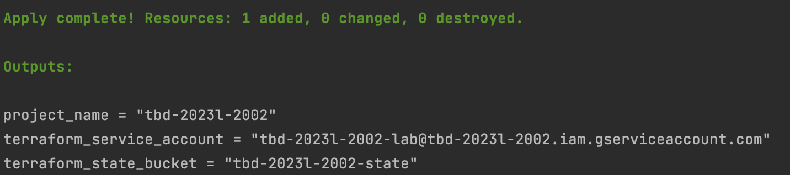
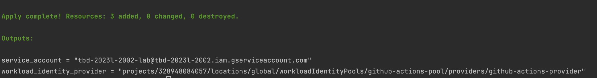
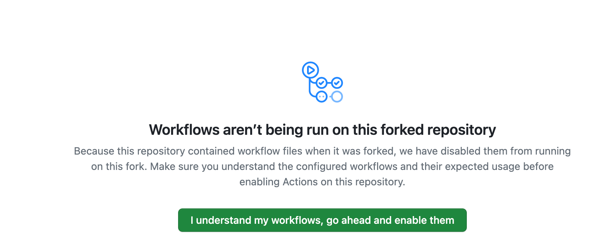
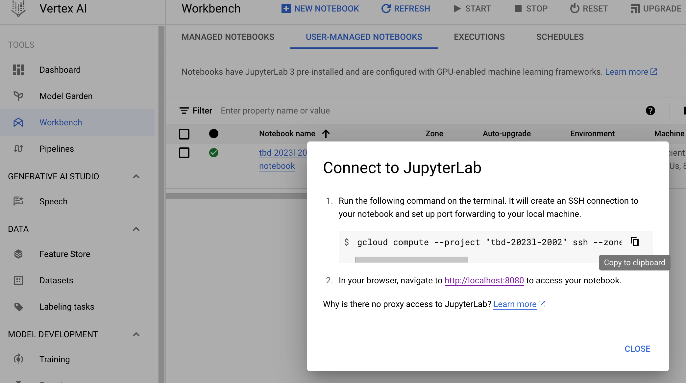
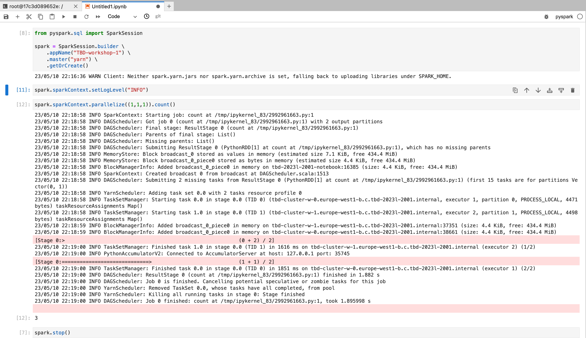

# TBD Workshop 1.
ddd
## Workshop goals
1. Learn how to provision computing resources for running Big Data analyses using the Infrastructure as Code (IaC) approach.
2. Learn how to set up opinionated CI/CD pipelines to deploy cloud infrastructure. 
3. Learn how to utilize linters for detecting security vulnerabilities in cloud infrastructure.
4. Learn how to run Apache Spark code in a distributed way on Hadoop cluster using
Vertex AI notebooks and Dataproc services on GCP.
5. Learn how to use Workload Identity Federation for a secure authentication from GitHub Actions
to Google Cloud.

## High level architecture

## Prerequisites
### Software
* Google Cloud SDK
* gsutil
* pre-commit
* Terraform ( [Requirements](#Requirements) )
* Python ~>3.8
* Linux/MacOS
* [pre-commit-terraform dependencies](https://github.com/antonbabenko/pre-commit-terraform)

### GCP
* Redeem a GCP coupon to create a billing account
* Authenticate to GCP to obtain the default credentials used for running the code
```bash
# first remove the stored credentials if exist
gcloud auth application-default revoke
# login and get the new application credentials
gcloud auth application-default login
```
## Project setup
1. Export shared environment variables
```bash
export TF_VAR_tbd_semester=2024L
# format: 20xx for teachers, student ID number for students 
export TF_VAR_user_id=9900
# use your own billing account id
export TF_VAR_billing_account=01F44C-CA9C7E-587C25

```
2. Enter `bootstrap` folder then init project and Terraform state bucket
```bash
cd bootstrap
terraform init
terraform apply
cd ..
```
3. CI/CD (Github Actions setup using [Workload Identity Federation](https://cloud.google.com/blog/products/identity-security/enabling-keyless-authentication-from-github-actions))
* Edit `env/backend.tfvars` file and set `bucket` variable with the Terraform state bucket
* Edit `env/project.tfvars` file and set `project_name`, `iac_service_account` variables using the output from the `bootstrap` phase, e.g.:

* Edit `cicd_bootstrap/conf/github_actions.tfvars` to set `github_org` and `github_repo`, e.g.:
```text
  github_org  = "mwiewior"
  github_repo = "tbd-workshop-1"
```
* Init state file and set env variables
```bash
cd cicd_bootstrap
terraform init -backend-config=../env/backend.tfvars
```
* Apply
```bash
# authenticate Docker backend with GCP
gcloud auth configure-docker
# create CI/CD integration using Workload Identity
terraform apply -var-file ../env/project.tfvars -var-file conf/github_actions.tfvars -compact-warnings
cd ..
```

4. Use output variables for configuring Github Actions workflow: `.github/workflows/pull-request.yml`,e.g. :

Please do not edit and hardcode these values in a YAML but set the Github Actions secrets instead
while preserving the secret names, i.e. `GCP_WORKLOAD_IDENTITY_PROVIDER_NAME`, `GCP_WORKLOAD_IDENTITY_SA_EMAIL` and `INFRACOST_API_KEY`.


5. Register on infracost.io, generate Infracost API key and enter it as `INFRACOST_API_KEY` in secrets on GitHub repository settings.

6. Install and configure `pre-commit`
```bash
pre-commit install
```

7. Commit changes, push to a branch and open a PR to **YOUR** repository main/master branch.
If you see a warning like this -- please enable the workflows:

...and repush your changes!

Once all Pull Requests checks **have passed** please merge your PR and wait until your release job finishes.
8. Navigate to the Vertex AI Workbench menu item, find your notebook on the list, press **CONNECT** and follow
the instructions


9. Check if `pyspark` kernel exists - if not then in your Jupyterlab enviroment add Python3.8 kernel:
```bash
python3.8 -m ipykernel install --user --name pyspark
```
10. Run a `Hello-world` PySpark application in a YARN-client mode:


11. Additional tasks using Terraform:
<ol type="a">
 <li>Add support for arbitrary machine types and worker nodes for a Dataproc cluster and JupyterLab instance</li>
 <li>Add support for preemptible/spot instances in a Dataproc cluster</li>
 <li>Perform additional hardening of Jupyterlab environment, i.e. disable sudo access and enable secure boot</li>
 <li>(Optional) Get access to Apache Spark WebUI</li>
</ol>

12. Create a BigQuery dataset and an external table (change storage location if needed)

```sql
CREATE SCHEMA IF NOT EXISTS demo OPTIONS(location = 'europe-west1');

CREATE OR REPLACE EXTERNAL TABLE demo.shakespeare
  OPTIONS (
  
  format = 'ORC',
  uris = ['gs://tbd-2023z-9900-data/data/shakespeare/*.orc']);


SELECT * FROM demo.shakespeare ORDER BY sum_word_count DESC LIMIT 5;

```


13. **Workshop 2** exercises are described in [Jupyter notebook](notebooks/workshop_2_mlops.ipynb)


14. **IMPORTANT**
:exclamation: :exclamation: :exclamation: Please remember to **destroy all** the resources after the workshop:

```bash
terraform init -backend-config=env/backend.tfvars
terraform destroy -no-color -var-file env/project.tfvars 
```
<!-- BEGINNING OF PRE-COMMIT-TERRAFORM DOCS HOOK -->
## Requirements

| Name | Version |
|------|---------|
| <a name="requirement_terraform"></a> [terraform](#requirement\_terraform) | ~> 1.5.0 |
| <a name="requirement_docker"></a> [docker](#requirement\_docker) | 3.0.2 |
| <a name="requirement_google"></a> [google](#requirement\_google) | ~> 5.23.0 |
| <a name="requirement_kubernetes"></a> [kubernetes](#requirement\_kubernetes) | 2.24.0 |

## Providers

| Name | Version |
|------|---------|
| <a name="provider_google"></a> [google](#provider\_google) | 5.23.0 |
| <a name="provider_kubernetes"></a> [kubernetes](#provider\_kubernetes) | 2.24.0 |

## Modules

| Name | Source | Version |
|------|--------|---------|
| <a name="module_composer"></a> [composer](#module\_composer) | ./modules/composer | n/a |
| <a name="module_data-pipelines"></a> [data-pipelines](#module\_data-pipelines) | ./modules/data-pipeline | n/a |
| <a name="module_dataproc"></a> [dataproc](#module\_dataproc) | ./modules/dataproc | n/a |
| <a name="module_dbt_docker_image"></a> [dbt\_docker\_image](#module\_dbt\_docker\_image) | ./modules/dbt_docker_image | n/a |
| <a name="module_gcr"></a> [gcr](#module\_gcr) | ./modules/gcr | n/a |
| <a name="module_jupyter_docker_image"></a> [jupyter\_docker\_image](#module\_jupyter\_docker\_image) | ./modules/jupyter_docker_image | n/a |
| <a name="module_jupyter_mlops_docker_image"></a> [jupyter\_mlops\_docker\_image](#module\_jupyter\_mlops\_docker\_image) | ./modules/jupyter_mlops_docker_image | n/a |
| <a name="module_vertex_ai_workbench"></a> [vertex\_ai\_workbench](#module\_vertex\_ai\_workbench) | ./modules/vertex-ai-workbench | n/a |
| <a name="module_vpc"></a> [vpc](#module\_vpc) | ./modules/vpc | n/a |

## Resources

| Name | Type |
|------|------|
| [google_compute_firewall.allow-all-internal](https://registry.terraform.io/providers/hashicorp/google/latest/docs/resources/compute_firewall) | resource |
| [kubernetes_service.dbt-task-service](https://registry.terraform.io/providers/hashicorp/kubernetes/2.24.0/docs/resources/service) | resource |
| [google_client_config.provider](https://registry.terraform.io/providers/hashicorp/google/latest/docs/data-sources/client_config) | data source |
| [google_container_cluster.composer-gke-cluster](https://registry.terraform.io/providers/hashicorp/google/latest/docs/data-sources/container_cluster) | data source |

## Inputs

| Name | Description | Type | Default | Required |
|------|-------------|------|---------|:--------:|
| <a name="input_ai_notebook_instance_owner"></a> [ai\_notebook\_instance\_owner](#input\_ai\_notebook\_instance\_owner) | Vertex AI workbench owner | `string` | n/a | yes |
| <a name="input_enable_composer"></a> [enable\_composer](#input\_enable\_composer) | Enable GCP Composer deployment and dependent modules | `bool` | `true` | no |
| <a name="input_jupyter_image_flavour"></a> [jupyter\_image\_flavour](#input\_jupyter\_image\_flavour) | Jupyterlab image flavour | `string` | `"dataops"` | no |
| <a name="input_project_name"></a> [project\_name](#input\_project\_name) | Project name | `string` | n/a | yes |
| <a name="input_region"></a> [region](#input\_region) | GCP region | `string` | `"europe-west1"` | no |

## Outputs

No outputs.
<!-- END OF PRE-COMMIT-TERRAFORM DOCS HOOK -->
