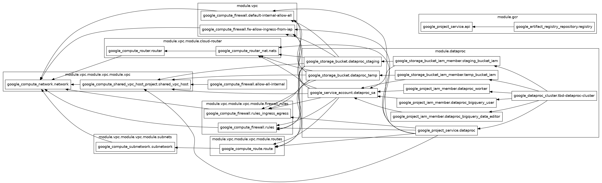

IMPORTANT ❗ ❗ ❗ Please remember to destroy all the resources after each work session. You can recreate infrastructure by creating new PR and merging it to master.


1. Authors:

   **_8_**

   _[\_\_link to forked repo_](https://github.com/Felooo8/tbd-workshop-1/)\*\*

2. Follow all steps in README.md.

3. From avaialble Github Actions select and run destroy on main branch.
4. Create new git branch and:

   1. Modify tasks-phase1.md file.

   2. Create PR from this branch to **YOUR** master and merge it to make new release.

   

5. Analyze terraform code. Play with terraform plan, terraform graph to investigate different modules.

   Wybrany moduł: vpc/
   Moduł vpc odpowiada za utworzenie całej infrastruktury sieciowej projektu. Tworzy główną sieć VPC (main-vpc), podsieci, trasę do internetu oraz reguły firewallowe, dzięki którym zasoby mogą komunikować się wewnętrznie i z internetem. Moduł wykorzystuje również cloud-router i cloud-nat, aby zapewnić dostęp do internetu VM-kom pozbawionym zewnętrznych adresów IP.
   Wejściami modułu są m.in. region, CIDR podsieci oraz nazwa projektu. Wyjściami są linki do utworzonej sieci i subnetu, które są później wykorzystywane przez moduły Dataproc i Composer.

   

6. Reach YARN UI

   **_place the command you used for setting up the tunnel, the port and the screenshot of YARN UI here_**
   Aby uzyskać dostęp do interfejsu YARN UI, utworzyłem tunel SSH do node'a master klastra Dataproc.

   ```bash
   gcloud compute ssh tbd-cluster-m \
   --project tbd-25z-3237333 \
   --zone europe-west1-b \
   --tunnel-through-iap \
   -- -N -L 8088:localhost:8088
   ```

   Po utworzeniu tunelu interfejs YARN był dostępny lokalnie pod adresem:

   ```bash
   http://localhost:8088
   ```

   Zrzut ekranu YARN UI:
   

7. Draw an architecture diagram (e.g. in draw.io) that includes:

   1. Description of the components of service accounts
   2. List of buckets for disposal

   

8. Create a new PR and add costs by entering the expected consumption into Infracost
   For all the resources of type: `google_artifact_registry`, `google_storage_bucket`, `google_service_networking_connection`
   create a sample usage profiles and add it to the Infracost task in CI/CD pipeline. Usage file [example](https://github.com/infracost/infracost/blob/master/infracost-usage-example.yml)

**_place the expected consumption you entered here_**

**_place the screenshot from infracost output here_**

9. Create a BigQuery dataset and an external table using SQL

**_place the code and output here_**

**_why does ORC not require a table schema?_**

10. Find and correct the error in spark-job.py

**_describe the cause and how to find the error_**

11. Add support for preemptible/spot instances in a Dataproc cluster

**_place the link to the modified file and inserted terraform code_**

12. Triggered Terraform Destroy on Schedule or After PR Merge. Goal: make sure we never forget to clean up resources and burn money.

Add a new GitHub Actions workflow that:

1. runs terraform destroy -auto-approve
2. triggers automatically:

a) on a fixed schedule (e.g. every day at 20:00 UTC)

b) when a PR is merged to main containing [CLEANUP] tag in title

Steps:

1. Create file .github/workflows/auto-destroy.yml
2. Configure it to authenticate and destroy Terraform resources
3. Test the trigger (schedule or cleanup-tagged PR)

**_paste workflow YAML here_**

**_paste screenshot/log snippet confirming the auto-destroy ran_**

**_write one sentence why scheduling cleanup helps in this workshop_**

```

```
