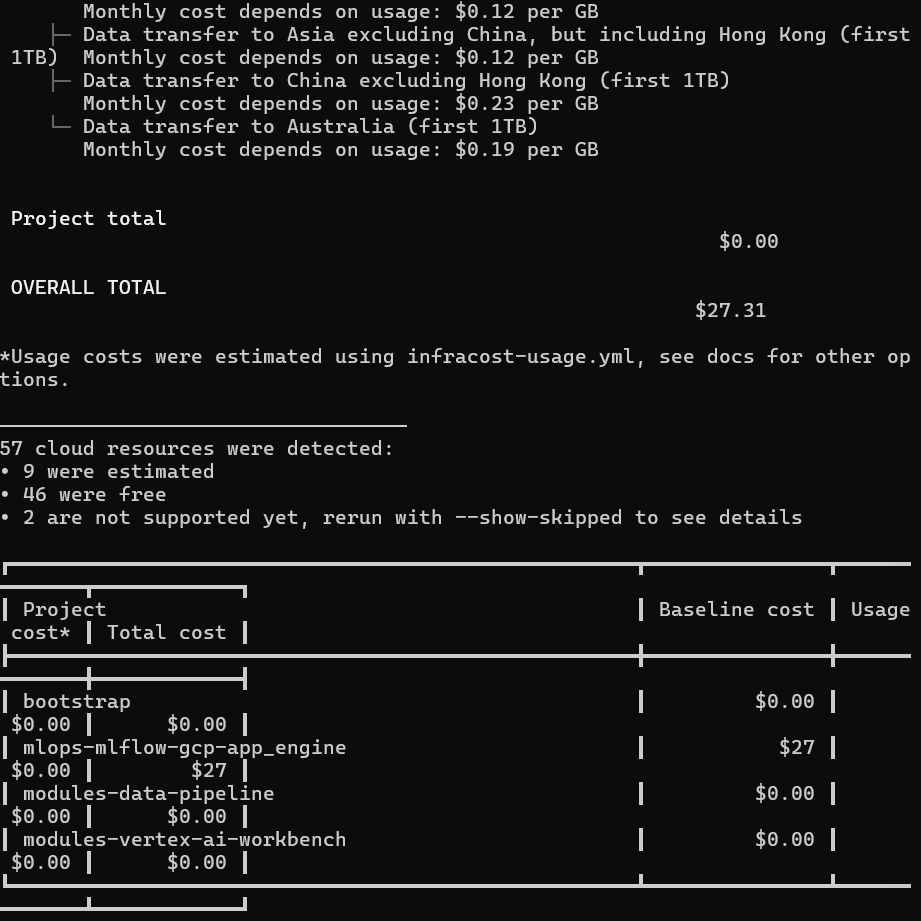

IMPORTANT ❗ ❗ ❗ Please remember to destroy all the resources after each work session. You can recreate infrastructure by creating new PR and merging it to master.
  

1. Authors:

    **Group 8:**
   
    - wojciech.dzikon.stud@pw.edu.pl
    - radoslaw.kasprzak.stud@pw.edu.pl
    - karol.ostrowski.stud@pw.edu.pl
    

    **https://github.com/RadoslawKasprzak/tbd-workshop-1**
   
3. Follow all steps in README.md.

4. Select your project and set budget alerts on 5%, 25%, 50%, 80% of 50$ (in cloud console -> billing -> budget & alerts -> create buget; unclick discounts and promotions&others while creating budget).

   

5. From avaialble Github Actions select and run destroy on main branch.
   
7. Create new git branch and:

    1. Modify tasks-phase1.md file.
    
    2. Create PR from this branch to **YOUR** master and merge it to make new release. 
    
    ***place the screenshot from GA after succesfull application of release***

   

9. Analyze terraform code. Play with terraform plan, terraform graph to investigate different modules.

    ***describe one selected module and put the output of terraform graph for this module here***

   **dataproc**

   This Terraform module defines the infrastructure for a **Dataproc cluster** on Google Cloud Platform. Google Cloud Dataproc allows you to use a variety of big data and analytics tools like Apache Spark. Apache Hadoop, Apache Hive.
The module creates a Dataproc cluster with the specified configuration.

    The `google_project_service` resource ensures the Dataproc service is enabled in the specified Google Cloud project with option ensures that the service is not disabled when the resource is destroyed. The `google_dataproc_cluster` resource provisions the Dataproc cluster (depends on the `google_project_service` resource). The cluster is created in the specified `region` (defaulting to `europe-west1`) and project (`project_name`). The cluster is configured with one master node and two worker nodes, all using the same `machine_type` (default: `e2-medium`) and disk configuration (100 GB standard persistent disk). The cluster uses the specified `image_version` (default: `2.1.27-ubuntu20`). The cluster is deployed in a specified `subnet` with internal IP only access. Also, the cluster includes Python package installations through initialization actions. The module outputs the name of the created Dataproc cluster.

    

       
11. Reach YARN UI
    
    ***place the command you used for setting up the tunnel, the port and the screenshot of YARN UI here***
    

    We set up a SSH tunneling via IAP to port 8088 in dataproc cluster -m in through local port 8088.

        gcloud compute ssh tbd-cluster-m --project=tbd-2025z-335202 --zone=europe-west1-d --tunnel-through-iap -- -L 8088:localhost:8088

   
11. Draw an architecture diagram (e.g. in draw.io) that includes:
    1. VPC topology with service assignment to subnets
    2. Description of the components of service accounts
    3. List of buckets for disposal
    4. Description of network communication (ports, why it is necessary to specify the host for the driver) of Apache Spark running from Vertex AI Workbech
  
    

12. Create a new PR and add costs by entering the expected consumption into Infracost

        For all the resources of type: `google_artifact_registry`, `google_storage_bucket`, `google_service_networking_connection`
        create a sample usage profiles and add it to the Infracost task in CI/CD pipeline. Usage file [example](https://github.com/infracost/infracost/blob/master/infracost-usage-example.yml) 

         As we only have 'google_storage_bucket' type existing in code we will proceed with:
         <!-- ./.terraform/modules/composer.composer/examples/simple_composer_env_v2/main.tf:resource "google_storage_bucket" "my_bucket" {
        ./bootstrap/main.tf:resource "google_storage_bucket" "tbd-state-bucket" {
        ./mlops/mlflow/gcp/app_engine/storage.tf:resource "google_storage_bucket" "mlflow_artifacts_bucket" {
        ./modules/data-pipeline/main.tf:resource "google_storage_bucket" "tbd-code-bucket" {
        ./modules/data-pipeline/main.tf:resource "google_storage_bucket" "tbd-data-bucket" {
        ./modules/vertex-ai-workbench/main.tf:resource "google_storage_bucket" "notebook-conf-bucket" { -->
        

   ***place the expected consumption you entered here***

    Expected consumption saved in infracost-usage.yml

    
   ***place the screenshot from infracost output here***

   

      API KEY for Infracost added to github secrets, infracosts steps in testing pipeline CICD checked - works.
      
11. Create a BigQuery dataset and an external table using SQL
    
    ***place the code and output here***

        CREATE SCHEMA IF NOT EXISTS demo OPTIONS(location = 'europe-west1');

        CREATE OR REPLACE EXTERNAL TABLE demo.shakespeare
        OPTIONS (
        
        format = 'ORC',
        uris = ['gs://tbd-2025z-335202-data/data/shakespeare/*.orc']);
      
      
        SELECT * FROM demo.shakespeare ORDER BY sum_word_count DESC LIMIT 5;

   
    ***why does ORC not require a table schema?***

      ORC doesn't require an external table schema because it is a self-describing format that embeds schema and metadata directly within the file, allowing tools to automatically infer the structure. This simplifies integration and ensures schema consistency.

  
13. Start an interactive session from Vertex AI workbench:

    ***place the screenshot of notebook here***

    

   
15. Find and correct the error in spark-job.py

    ***describe the cause and how to find the error***
    
        spark-job.py is used by dataproc as a submitted job. Job does not work with predefined data bucket localization. This information can be found in tbd-cluster jobs logs. Changed to tbd-2025z-335202-data.
        Succesfully submitted job and data saved to gs://tbd-2025z-335202-data/data/shakespeare

    

17. Additional tasks using Terraform:

    1. Add support for arbitrary machine types and worker nodes for a Dataproc cluster and JupyterLab instance

    ***place the link to the modified file and inserted terraform code***

        Changes were made in :  modules\vertex-ai-workbench\main.tf
                            modules\vertex-ai-workbench\variables.tf
                            modules\dataproc\main.tf
                            modules\dataproc\variables.tf
    
    
    

    2. Add support for preemptible/spot instances in a Dataproc cluster

    ***place the link to the modified file and inserted terraform code***

        Changes were made in: modules\dataproc\main.tf \
                            modules\dataproc\variables.tf
        Inserted code in main.tf:
    
          preemptible_worker_config {
            num_instances = var.preemptible_worker_count
            preemptibility = "PREEMPTIBLE"
            disk_config {
              boot_disk_type    = "pd-standard"
              boot_disk_size_gb = 100
            }
          }
        Inserted code in variables.tf:
    
          variable "preemptible_worker_count" {
            description = "Number of preemptible worker nodes in the Dataproc cluster"
            type        = number
            default     = 1
          }
        Based on information from https://registry.terraform.io/providers/hashicorp/google/latest/docs/resources/dataproc_cluster

        Temporary deleted from code <=> insufficent quotas for CPUs
    
    3. Perform additional hardening of Jupyterlab environment, i.e. disable sudo access and enable secure boot
    
    ***place the link to the modified file and inserted terraform code***

        Changes were made in: modules\vertex-ai-workbench\main.tf \
                            modules\vertex-ai-workbench\resources\notebook_post_startup_script.sh
        In modules\vertex-ai-workbench\main.tf:
          added:
          shielded_instance_config {
            enable_secure_boot          = true
            enable_vtpm                 = true
            enable_integrity_monitoring = true
          }
    
        In modules\vertex-ai-workbench\resources\notebook_post_startup_script.sh added:
          USER_TO_REMOVE_SUDO=$(whoami)
          sudo deluser $USER_TO_REMOVE_SUDO sudo

    4. (Optional) Get access to Apache Spark WebUI

    ***place the link to the modified file and inserted terraform code***

        Changes were made in: modules\dataproc\main.tf \
                            modules\vpc\main.tf
        In modules\vpc\main.tf added resource:
          resource "google_compute_firewall" "spark_webui" {
            name    = "allow-spark-webui"
            network = module.vpc.network_id
          
            allow {
              protocol = "tcp"
              ports    = ["4040", "8080"]
            }
          
            source_ranges = ["0.0.0.0/0"] # Adjust to restrict access to specific IPs
            target_tags   = ["spark-webui"]
          }

        In modules\dataproc\main.tf added:
          tags             = ["spark-webui"]
          in gce_cluster_config{}
