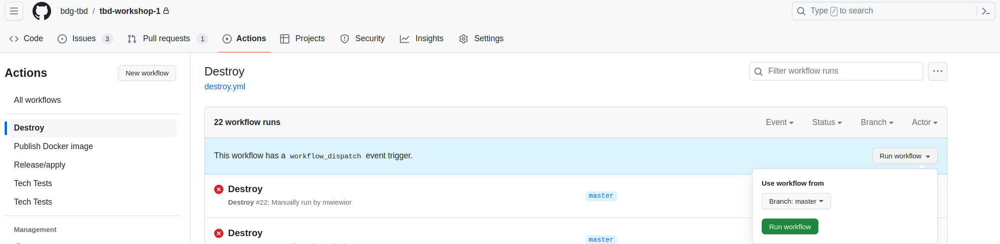
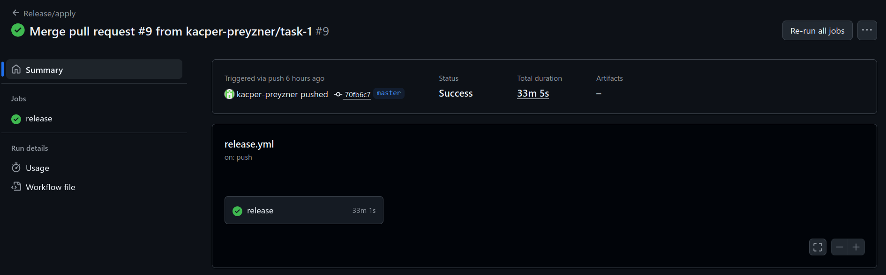
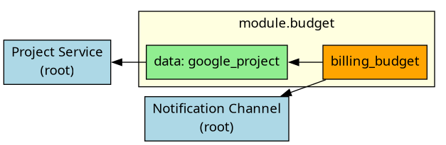
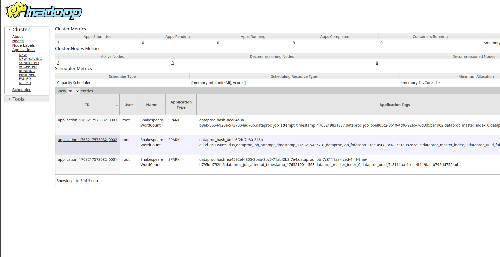
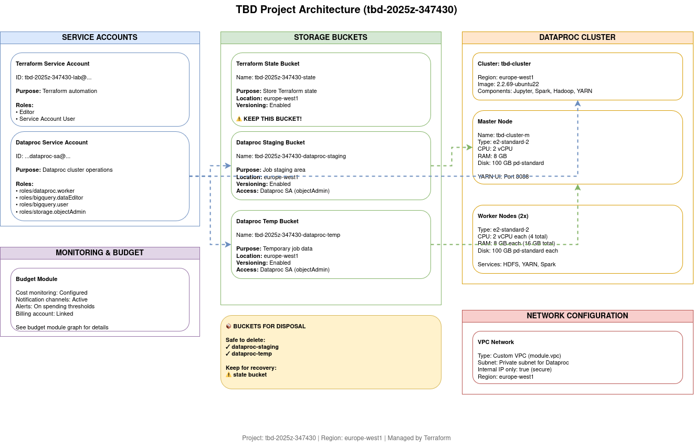
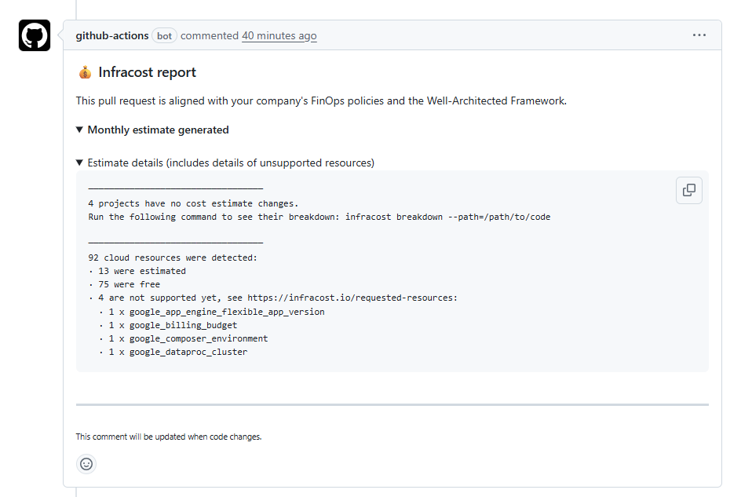
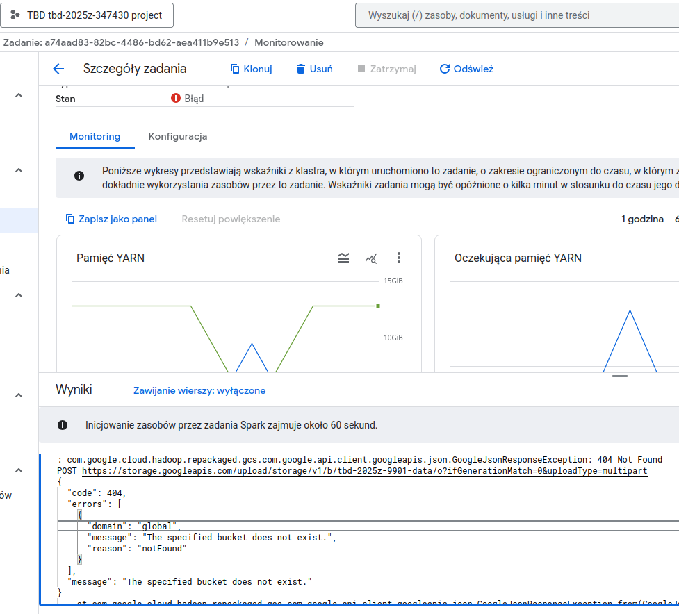
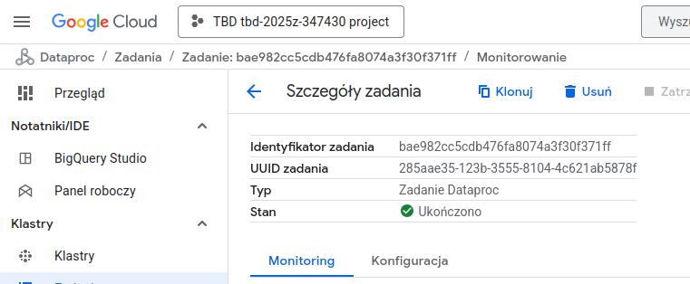
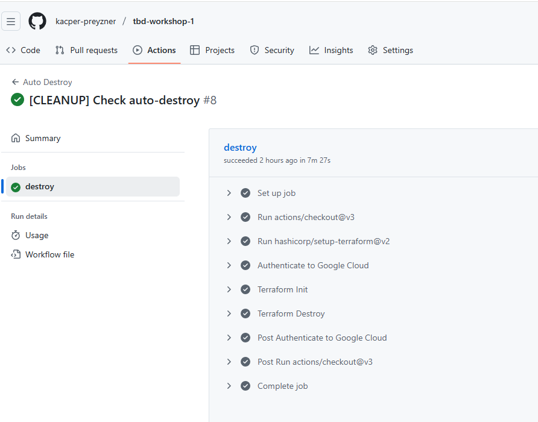

IMPORTANT ❗ ❗ ❗ Please remember to destroy all the resources after each work session. You can recreate infrastructure by creating new PR and merging it to master.



1. Authors:

   Grupa 13

   [repo](https://github.com/kacper-preyzner/tbd-workshop-1)

2. Follow all steps in README.md.

3. From avaialble Github Actions select and run destroy on main branch.

4. Create new git branch and:
    1. Modify tasks-phase1.md file.

    2. Create PR from this branch to **YOUR** master and merge it to make new release.

    


5. Analyze terraform code. Play with terraform plan, terraform graph to investigate different modules.

    ***describe one selected module and put the output of terraform graph for this module here***

    *Budget* module takes care of cost management for GCP project by creating a billing budget that monitors spending and sends alerts when cost thresholds are exceeded

    

6. Reach YARN UI

   ***place the command you used for setting up the tunnel, the port and the screenshot of YARN UI here***

   ```
   gcloud compute ssh tbd-cluster-m \
   --zone=europe-west1-c \
   --project=tbd-2025z-347430 \
   -- -N -L 8088:localhost:8088


7. Draw an architecture diagram (e.g. in draw.io) that includes:
    1. Description of the components of service accounts
    2. List of buckets for disposal

    ***place your diagram here***

    

8. Create a new PR and add costs by entering the expected consumption into Infracost
For all the resources of type: `google_artifact_registry`, `google_storage_bucket`, `google_service_networking_connection`
create a sample usage profiles and add it to the Infracost task in CI/CD pipeline. Usage file [example](https://github.com/infracost/infracost/blob/master/infracost-usage-example.yml)

```
version: 0.1

resource_usage:

  # ----------------------------------------------------------
  # google_artifact_registry
  # ----------------------------------------------------------
  google_artifact_registry.registry:
    storage_gb: 40               # ilość przechowywanych artefaktów
    monthly_egress_data_gb: 5    # niewielki transfer wychodzący
    monthly_package_uploads: 20  # liczba uploadów miesięcznie
    monthly_package_downloads: 100  # liczba pobrań miesięcznie

  # ----------------------------------------------------------
  # google_storage_bucket
  # ----------------------------------------------------------
  google_storage_bucket.tbd-state-bucket:
    storage_gb: 500                                 # Approximate Terraform state size
    monthly_class_a_operations: 5000               # PUT, POST, LIST operations
    monthly_class_b_operations: 20000              # GET operations
    monthly_egress_data_gb: 100                     # Outbound transfer
    monthly_ingress_data_gb: 50                     # Inbound transfer

  # ----------------------------------------------------------
  # google_service_networking_connection – niewielki ruch
  # ----------------------------------------------------------
  google_service_networking_connection.default:
     monthly_egress_gb: 5
     monthly_ingress_gb: 5
```

 

9. Create a BigQuery dataset and an external table using SQL

ORC file was downloaded from: https://github.com/apache/orc/blob/main/examples/TestOrcFile.test1.orc

```sql
CREATE SCHEMA IF NOT EXISTS `tbd-2025z-347430.tbd_dataset`
OPTIONS (
location = 'europe-west1'
);

CREATE EXTERNAL TABLE IF NOT EXISTS `tbd-2025z-347430.tbd_dataset.tab-ext`
OPTIONS (
format = 'ORC',
uris = ['gs://tbd-2025z-347430-data/data/*.orc']
);
```
    
***place the code and output here***

***why does ORC not require a table schema?***

ORC (Optimized Row Columnar) files are self-describing, meaning they store metadata such as column names, data types, and structure. This allows systems like BigQuery to automatically interpret the data without requiring a predefined table schema, simplifying data ingestion and processing.

11. Find and correct the error in spark-job.py

    The error is an incorrect/not specified correctly data bucket number. In the original code it's *9901*. When we submit the code to run on cluster, we can see Error "The specified bucket does not exist" in logs:
    

    After changing the bucket number to ours and submitting it again we get a succesfull run:
    

    With an output table:
    ```
    +----+--------------+
    |word|sum_word_count|
    +----+--------------+
    | the|         25568|
    |   I|         21028|
    | and|         19649|
    |  to|         17361|
    |  of|         16438|
    |   a|         13409|
    | you|         12527|
    |  my|         11291|
    |  in|         10589|
    |  is|          8735|
    |that|          8561|
    | not|          8395|
    |  me|          8030|
    | And|          7780|
    |with|          7224|
    |  it|          7137|
    | his|          6811|
    |  be|          6724|
    |your|          6244|
    | for|          6154|
    +----+--------------+
    only showing top 20 rows
    ```

12. Add support for preemptible/spot instances in a Dataproc cluster

      To the file [modules/dataproc/variables.tf](modules/dataproc/variables.tf) added a variable *preeemptible_worker_count*:
      ```
      variable "preeemptible_worker_count" {
        type        = number
        default     = 0
        description = "Number of preemptible worker nodes"
      }
      ```
      To the file [modules/dataproc/main.tf](modules/dataproc/main.tf) added a *preemptible_worker_config* block:
      ```
       preemptible_worker_config {
         num_instances  = var.preeemptible_worker_count
         preemptibility = "SPOT"
         disk_config {
           boot_disk_type    = "pd-standard"
           boot_disk_size_gb = 100
         }
       }
      ```
13. Triggered Terraform Destroy on Schedule or After PR Merge. Goal: make sure we never forget to clean up resources and burn money.

Add a new GitHub Actions workflow that:
  1. runs terraform destroy -auto-approve
  2. triggers automatically:
 
   a) on a fixed schedule (e.g. every day at 20:00 UTC)
 
   b) when a PR is merged to main containing [CLEANUP] tag in title

Steps:
  1. Create file .github/workflows/auto-destroy.yml
  2. Configure it to authenticate and destroy Terraform resources
  3. Test the trigger (schedule or cleanup-tagged PR)
```
name: Auto Destroy

on:
  schedule:
    - cron: "0 2 * * *"   # Run daily at 02:00 UTC, 03:00 Polish winter time
  pull_request:
    types:
      - closed
    branches:
      - master

permissions: read-all

jobs:
  destroy:
    if: |
      github.event_name == 'schedule' ||
      (github.event_name == 'pull_request' &&
       github.event.pull_request.merged == true &&
       contains(github.event.pull_request.title, '[CLEANUP]'))

    runs-on: ubuntu-latest
    permissions:
      contents: write
      id-token: write
      pull-requests: write
      issues: write

    steps:
    - uses: 'actions/checkout@v3'

    - uses: hashicorp/setup-terraform@v2
      with:
        terraform_version: 1.11.0

    - id: 'auth'
      name: 'Authenticate to Google Cloud'
      uses: 'google-github-actions/auth@v1'
      with:
        token_format: 'access_token'
        workload_identity_provider: ${{ secrets.GCP_WORKLOAD_IDENTITY_PROVIDER_NAME }}
        service_account: ${{ secrets.GCP_WORKLOAD_IDENTITY_SA_EMAIL }}

    - name: Terraform Init
      id: init
      run: terraform init -backend-config=env/backend.tfvars

    - name: Terraform Destroy
      id: destroy
      run: terraform destroy -no-color -var-file env/project.tfvars -auto-approve
      continue-on-error: false
```


Scheduling cleanup helps to insure that we don't burn through all the resources by forgetting to run destroy manually after our work. It was scheduled for 3 a.m. Polish winter time, because this is the optimal time between the time we might actively work on the project (which is mostly evening to early night), and time the project was running for too long without work done on it. Adding a destroy on tag in pull-request helps to triger it faster when we don't need the system running after, without having to go to actions.
