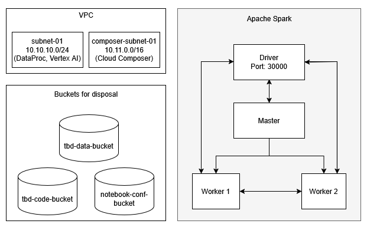
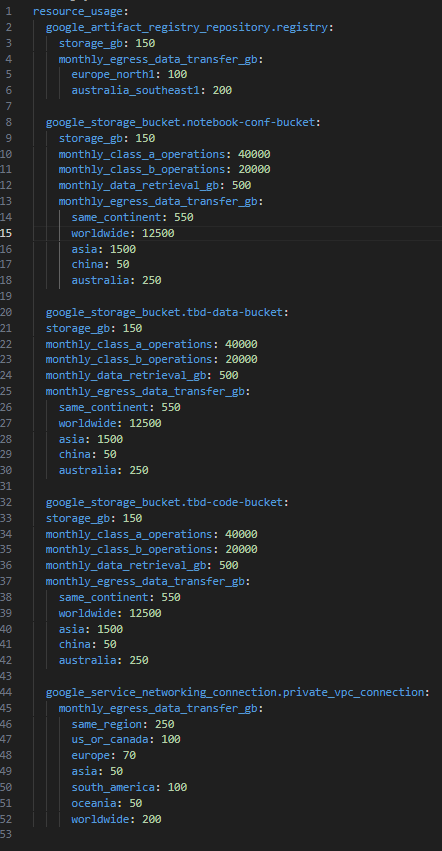
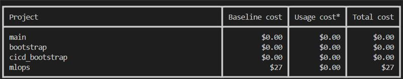
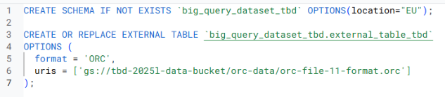

IMPORTANT ❗ ❗ ❗ Please remember to destroy all the resources after each work session. You can recreate infrastructure by creating new PR and merging it to master.
  

1. Authors:

   Izabela Lengiewicz, Katarzyna Zaleska, Katarzyna Witowska

   **Group number** - 11

   **Repository link** - https://github.com/IzabelaLee/tbd-zespol-11

2. Follow all steps in README.md.

3. In boostrap/variables.tf add your emails to variable "budget_channels".

4. From avaialble Github Actions select and run destroy on main branch.
   
5. Create new git branch and:
    1. Modify tasks-phase1.md file.
    
    2. Create PR from this branch to **YOUR** master and merge it to make new release. 
    
    ***place the screenshot from GA after succesfull application of release***

6. Analyze terraform code. Play with terraform plan, terraform graph to investigate different modules.

    ***describe one selected module and put the output of terraform graph for this module here***
   
7. Reach YARN UI
   
   ***place the command you used for setting up the tunnel, the port and the screenshot of YARN UI here***
   
8. Draw an architecture diagram (e.g. in draw.io) that includes:
    1. VPC topology with service assignment to subnets
    2. Description of the components of service accounts
    3. List of buckets for disposal
    4. Description of network communication (ports, why it is necessary to specify the host for the driver) of Apache Spark running from Vertex AI Workbech

    ***Service Account Components:***

    - Terraform Service Account (Terraform SA):
    This account allows Terraform to authenticate with the cloud provider and manage infrastructure resources. It grants Terraform the necessary permissions to create, modify, and delete cloud components.

    - Google Cloud Composer Service Account (Composer SA):
    Used by Google Cloud Composer to orchestrate workflows. This service account enables access to other Google Cloud services like Cloud Storage and BigQuery, which are essential for running DAGs and handling data processing tasks.

    - Infrastructure as Code Service Account (IaC SA):
    Utilized by infrastructure automation tools to provision and manage cloud infrastructure. In our setup, this account is used within GitHub Actions to authenticate and perform tasks such as deploying infrastructure automatically when changes are merged into the main branch.

    ***Network Communication***

    - Coordinating Resources: The driver communicates with the cluster’s master node to manage and assign resources across the workers. Clearly specifying the host makes sure this connection can happen reliably.

    - Managing Task Execution: The driver is responsible for breaking down the application into tasks and assigning them to the worker nodes. Knowing the driver's address helps streamline this process and maintain proper control over execution.

    - Ensuring Stability: If something goes wrong during execution, the system must know where the driver is running in order to recover tasks or reassign work, helping maintain stability and uptime.

    - Optimizing Data Transfer: To allow efficient communication and data movement between nodes, the system needs to understand the network structure — including the driver's location within it.

    

9. Create a new PR and add costs by entering the expected consumption into Infracost
For all the resources of type: `google_artifact_registry`, `google_storage_bucket`, `google_service_networking_connection`
create a sample usage profiles and add it to the Infracost task in CI/CD pipeline. Usage file [example](https://github.com/infracost/infracost/blob/master/infracost-usage-example.yml) 

    **Command**

    infracost breakdown --path=plan.json --usage-file=infracost-usage.yml

   **infracost-usage.yml:**

   

   **output:**

   

10. Create a BigQuery dataset and an external table using SQL
    
    **SQL Query:**

    

    **output:**

    
   
    **Why does ORC not require a table schema?**

    ORC files embed the table schema directly in their file footer, along with metadata like column types, row count, and statistics. Because of this, tools like BigQuery can automatically detect the schema when reading ORC files, removing the need to manually define it in many cases — especially when using schema autodetection.

11. Find and correct the error in spark-job.py

    ***describe the cause and how to find the error***

12. Add support for preemptible/spot instances in a Dataproc cluster

    ***Modified file:***
    https://github.com/IzabelaLee/tbd-zespol-11/blob/master/modules/dataproc/main.tf

    ***inserted code:***

        preemptible_worker_config {
            num_instances = 1
        }
    

    
