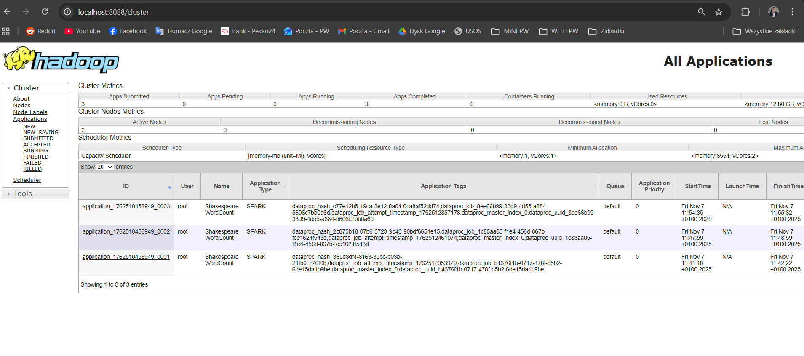
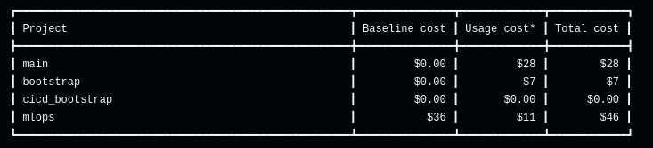

IMPORTANT ❗ Please remember to destroy all the resources after each work session. You can recreate infrastructure by creating new PR and merging it to master.
  


1. Authors:

   ***Group nr: 12***

   ***[Link to forked repo](https://github.com/kubaurban/tbd-workshop)***
   
2. Follow all steps in README.md.

3. From avaialble Github Actions select and run destroy on main branch.
   
4. Create new git branch and:
    1. Modify tasks-phase1.md file.
    
    2. Create PR from this branch to **YOUR** master and merge it to make new release. 
    
    


5. Analyze terraform code. Play with terraform plan, terraform graph to investigate different modules.

    We analyzed the **dataproc** module, which is responsible for creating a Dataproc cluster.

    The root *main.tf* indicates that this module depends on a VPC module. Indeed, it takes the subnet value as input, which is an output of the VPC module creation. The module output is a newly created Dataproc cluster name.

    Using the following Terraform command, we created a plan file named *dataproc_plan.tfplan*:

    ```sh
    terraform plan -target=module.dataproc -var-file=env/project.tfvars -out=dataproc_plan.tfplan -input=false -compact-warnings
    ```

    After converting this plan file into a JSON file, we discovered that the module contains multiple resources, including IAM role assignments (e.g., *bigquery_data_editor*, *bigquery_user*, etc.), a Dataproc service account, GCS buckets, and the Dataproc cluster itself.

    We also generated a dependency diagram of this module using terraform graph within the module folder:

    ```dot
    digraph G {
        rankdir = "RL";
        node [shape = rect, fontname = "sans-serif"];
        "google_dataproc_cluster.tbd-dataproc-cluster" [label="google_dataproc_cluster.tbd-dataproc-cluster"];
        "google_project_iam_member.dataproc_bigquery_data_editor" [label="google_project_iam_member.dataproc_bigquery_data_editor"];
        "google_project_iam_member.dataproc_bigquery_user" [label="google_project_iam_member.dataproc_bigquery_user"];
        "google_project_iam_member.dataproc_worker" [label="google_project_iam_member.dataproc_worker"];
        "google_project_service.dataproc" [label="google_project_service.dataproc"];
        "google_service_account.dataproc_sa" [label="google_service_account.dataproc_sa"];
        "google_storage_bucket.dataproc_staging" [label="google_storage_bucket.dataproc_staging"];
        "google_storage_bucket.dataproc_temp" [label="google_storage_bucket.dataproc_temp"];
        "google_storage_bucket_iam_member.staging_bucket_iam" [label="google_storage_bucket_iam_member.staging_bucket_iam"];
        "google_storage_bucket_iam_member.temp_bucket_iam" [label="google_storage_bucket_iam_member.temp_bucket_iam"];
        "google_dataproc_cluster.tbd-dataproc-cluster" -> "google_project_iam_member.dataproc_bigquery_data_editor";
        "google_dataproc_cluster.tbd-dataproc-cluster" -> "google_project_iam_member.dataproc_bigquery_user";
        "google_dataproc_cluster.tbd-dataproc-cluster" -> "google_project_iam_member.dataproc_worker";
        "google_dataproc_cluster.tbd-dataproc-cluster" -> "google_project_service.dataproc";
        "google_dataproc_cluster.tbd-dataproc-cluster" -> "google_storage_bucket_iam_member.staging_bucket_iam";
        "google_dataproc_cluster.tbd-dataproc-cluster" -> "google_storage_bucket_iam_member.temp_bucket_iam";
        "google_project_iam_member.dataproc_bigquery_data_editor" -> "google_service_account.dataproc_sa";
        "google_project_iam_member.dataproc_bigquery_user" -> "google_service_account.dataproc_sa";
        "google_project_iam_member.dataproc_worker" -> "google_service_account.dataproc_sa";
        "google_storage_bucket_iam_member.staging_bucket_iam" -> "google_service_account.dataproc_sa";
        "google_storage_bucket_iam_member.staging_bucket_iam" -> "google_storage_bucket.dataproc_staging";
        "google_storage_bucket_iam_member.temp_bucket_iam" -> "google_service_account.dataproc_sa";
        "google_storage_bucket_iam_member.temp_bucket_iam" -> "google_storage_bucket.dataproc_temp";
    }
    ```

    

   
6. Reach YARN UI
   
    We added europe-west1 region to config and set up the tunnel by the following commands. We used port 8088.
    ```
    gcloud config set dataproc/region europe-west1
    gcloud compute ssh tbd-cluster-m --zone=europe-west1-d -- -L 8088:localhost:8088
    ```

    
  
   
8. Draw an architecture diagram (e.g. in draw.io) that includes:
    1. Description of the components of service accounts
    2. List of buckets for disposal

    Based on diagram generated for solution with terraform graph we created leaner diagram presenting solution modular architecture. The following diagram includes service accounts (blue colored) linked to IAM roles and disposable buckets (yellow colored). We omitted service accounts (visible on diagram) created implicitly - we highlighted only those specified explicitly in terraform code.
    
    

9. Create a new PR and add costs by entering the expected consumption into Infracost
For all the resources of type: `google_artifact_registry`, `google_storage_bucket`, `google_service_networking_connection`
create a sample usage profiles and add it to the Infracost task in CI/CD pipeline. Usage file [example](https://github.com/infracost/infracost/blob/master/infracost-usage-example.yml) 

    Here is the *infracost-usage.yml* file we added:
    ```yaml
    version: 0.1
    resource_type_default_usage:

        google_artifact_registry_repository:
            monthly_storage_gb: 50                   
            monthly_egress_data_gb: 100               
            monthly_artifact_upload_gb: 20           
            api_requests: 200000

        google_storage_bucket:
            storage_gb: 200
            monthly_class_a_operations: 500000
            monthly_class_b_operations: 1000000
            monthly_egress_data_gb: 150
            monthly_regional_data_transfer_gb: 50  

        google_service_networking_connection:
            monthly_egress_data_transfer_gb:
            same_region: 250                
            us_or_canada: 100              
            europe: 70          
    ```
    Then we included it in our workflow from *pull-request.yml*:
    ```yaml
    - name: Generate Infracost cost estimate baseline
      run: |
        infracost breakdown --path="." \
                            --format=json \
                            --out-file=/tmp/infracost-base.json \
                            --usage-file=infracost-usage.yml
    ```
    And here is the Infracost output. As we can see, usage costs for each project were added:

    

10. Create a BigQuery dataset and an external table using SQL

    We added sample .orc file from Apache repo https://github.com/apache/orc/blob/main/examples/demo-12-zlib.orc to our bucket. We executed commands below
    

    ORC files don’t need a separate table schema because they are self-describing and store the schema internally.
    
12. Find and correct the error in spark-job.py

    ***describe the cause and how to find the error***

13. Add support for preemptible/spot instances in a Dataproc cluster

    ***place the link to the modified file and inserted terraform code***
    
14. Triggered Terraform Destroy on Schedule or After PR Merge. Goal: make sure we never forget to clean up resources and burn money.

Add a new GitHub Actions workflow that:
  1. runs terraform destroy -auto-approve
  2. triggers automatically:
   
   a) on a fixed schedule (e.g. every day at 20:00 UTC)
   
   b) when a PR is merged to main containing [CLEANUP] tag in title

Steps:
  1. Create file .github/workflows/auto-destroy.yml
  2. Configure it to authenticate and destroy Terraform resources
  3. Test the trigger (schedule or cleanup-tagged PR)
     
Here is the workflow we put into *.github/workflows/auto-destroy.yml*:
```yaml
name: Auto Destroy

on:
  pull_request:
    types:
      - closed
    branches:
      - master
  
  schedule:
    - cron: '10 22 * * *' 

permissions: read-all

jobs:
  auto-destroy:
    runs-on: ubuntu-latest
    permissions:
      contents: write
      id-token: write
      pull-requests: write
      issues: write
    if: >
      github.event.pull_request.merged == true &&
      contains(github.event.pull_request.title, '[CLEANUP]')

    steps:
    - uses: 'actions/checkout@v3'
    - uses: hashicorp/setup-terraform@v2
      with:
        terraform_version: 1.11.0
    - id: 'auth'
      name: 'Authenticate to Google Cloud'
      uses: 'google-github-actions/auth@v1'
      with:
        token_format: 'access_token'
        workload_identity_provider: ${{ secrets.GCP_WORKLOAD_IDENTITY_PROVIDER_NAME }}
        service_account: ${{ secrets.GCP_WORKLOAD_IDENTITY_SA_EMAIL }}
    - name: Terraform Init
      id: init
      run: terraform init -backend-config=env/backend.tfvars
    - name: Terraform Destroy
      id: destroy
      run: terraform destroy -no-color -var-file env/project.tfvars -auto-approve
      continue-on-error: false
```
As you can see, the above workflow is triggered when:
- PR title contains *[CLEANUP]* tag
- the time is *22:10*
  
To test if this works we created a PR with *[CLEANUP]* tag and we merged it to *master* branch. *Auto-destroy* workflow was triggered:


***write one sentence why scheduling cleanup helps in this workshop***
