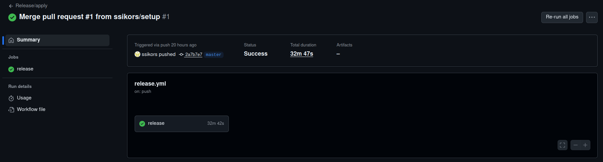
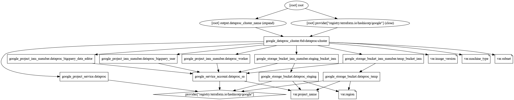
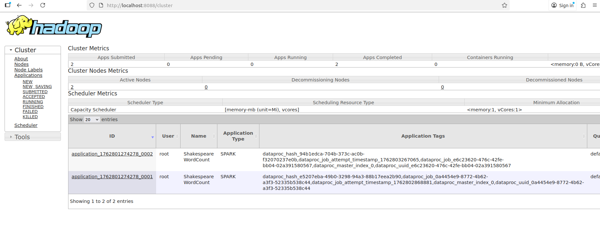
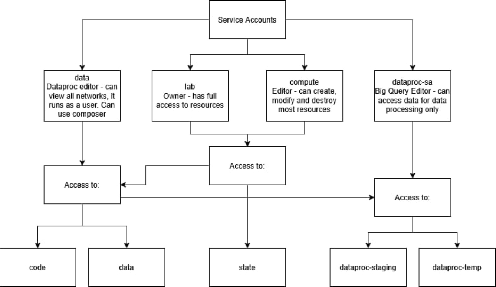

IMPORTANT ❗ ❗ ❗ Please remember to destroy all the resources after each work session. You can recreate infrastructure by creating new PR and merging it to master.
  


1. Authors:

   ***Group 11***

   ***[https://github.com/ssikors/tbd-workshop-1](https://github.com/ssikors/tbd-workshop-1)***
   
2. Follow all steps in README.md.

3. From avaialble Github Actions select and run destroy on main branch.
   
4. Create new git branch and:
    1. Modify tasks-phase1.md file.
    
    2. Create PR from this branch to **YOUR** master and merge it to make new release. 
    
    **Release result:**
    


5. Analyze terraform code. Play with terraform plan, terraform graph to investigate different modules.

    
    Dataproc module creates a Google Cloud Dataproc cluster, its infrastructure and permissions. It enables the Dataproc API, creates a dedicated service account with roles for Dataproc and BigQuery, and sets up staging and temporary Cloud Storage buckets with access granted to that service account. It also deploys a Dataproc cluster configured with specific software components, network settings, and initialization scripts for Python package installation.
   
6. Reach YARN UI
   
    **Port:** 8088

   **Command:**
   ```
   gcloud compute ssh tbd-cluster-m \
         --project=tbd-2025z-318720 \
         -- -L 8088:localhost:8088
   ```

    **Screenshot:**
   
   
7. Draw an architecture diagram (e.g. in draw.io) that includes:
    1. Description of the components of service accounts
    2. List of buckets for disposal
    
    


8. Create a new PR and add costs by entering the expected consumption into Infracost
For all the resources of type: `google_artifact_registry`, `google_storage_bucket`, `google_service_networking_connection`
create a sample usage profiles and add it to the Infracost task in CI/CD pipeline. Usage file [example](https://github.com/infracost/infracost/blob/master/infracost-usage-example.yml) 

   version: 0.1
resource_usage:
  module.gcr.google_artifact_registry_repository.registry:
    storage_gb: 50
  module.data-pipelines.google_storage_bucket.tbd-data-bucket:
    storage_gb: 50
  module.dataproc.google_storage_bucket.dataproc_staging:
    storage_gb: 100
  module.dataproc.google_storage_bucket.dataproc_temp:
    storage_gb: 50
  module.vpc.module.cloud-router.google_compute_router_nat.nats["nat-gateway"]: 
    network_egress_gb: 1000

   


1. Create a BigQuery dataset and an external table using SQL
    
    **Creating the schema**
    ```
    CREATE SCHEMA `tbd-2025z-318720`.TEST_DATASET_1
    OPTIONS (
        description = 'This is a description',
        labels = [('class','tbd'),('stage','first')],
        location = 'europe-west1',
        max_time_travel_hours = 48);
    ```
    
   
    **Creating the external table**
    ```
    CREATE OR REPLACE EXTERNAL TABLE `tbd-2025z-318720.TEST_DATASET_1.dummy_external`
    (
    id INT64,
    name STRING
    )
    OPTIONS (
    format = 'CSV',
    uris = ['gs://tbd-2025z-318720-data/dummy.csv'],
    skip_leading_rows = 1
    );
    ```

    

    ***Why does ORC not require a table schema?***
    
    The ORC data format would not require defining a table schema here because it is self-describing, which allows BigQuery to read the schema from .orc file metadata.

2.  Find and correct the error in spark-job.py

    ***describe the cause and how to find the error***

3.  Add support for preemptible/spot instances in a Dataproc cluster

    ***place the link to the modified file and inserted terraform code***
    
4.  Triggered Terraform Destroy on Schedule or After PR Merge. Goal: make sure we never forget to clean up resources and burn money.

Add a new GitHub Actions workflow that:
  1. runs terraform destroy -auto-approve
  2. triggers automatically:
   
   a) on a fixed schedule (e.g. every day at 20:00 UTC)
   
   b) when a PR is merged to main containing [CLEANUP] tag in title

Steps:
  1. Create file .github/workflows/auto-destroy.yml
  2. Configure it to authenticate and destroy Terraform resources
  3. Test the trigger (schedule or cleanup-tagged PR)
     
***paste workflow YAML here***

***paste screenshot/log snippet confirming the auto-destroy ran***

***write one sentence why scheduling cleanup helps in this workshop***
