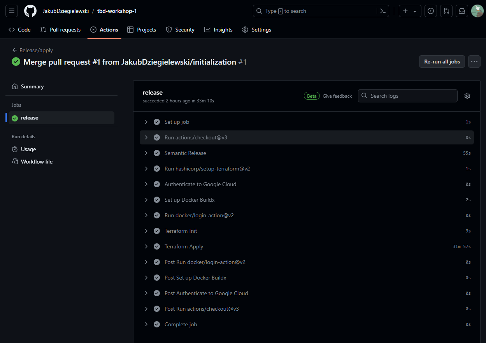
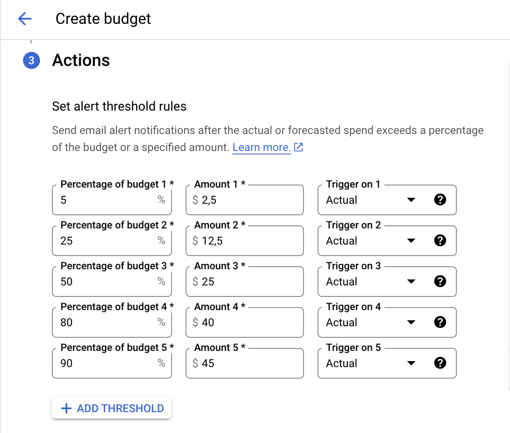
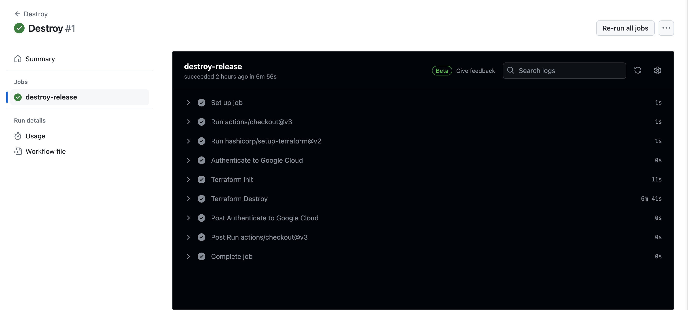
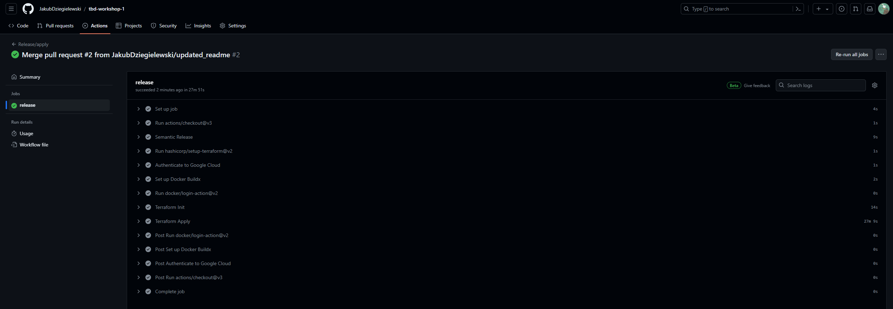
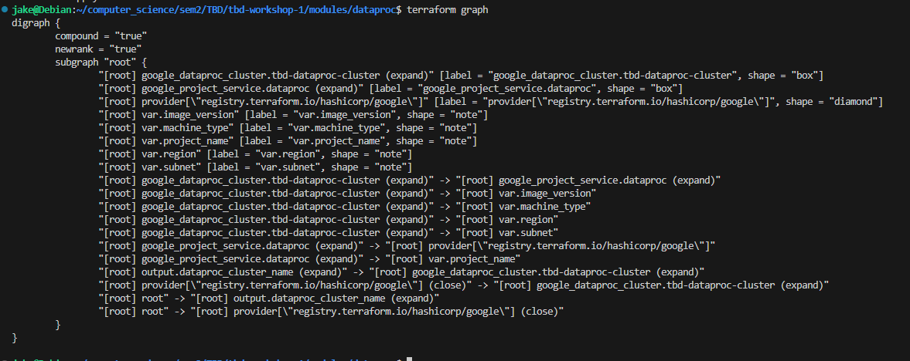
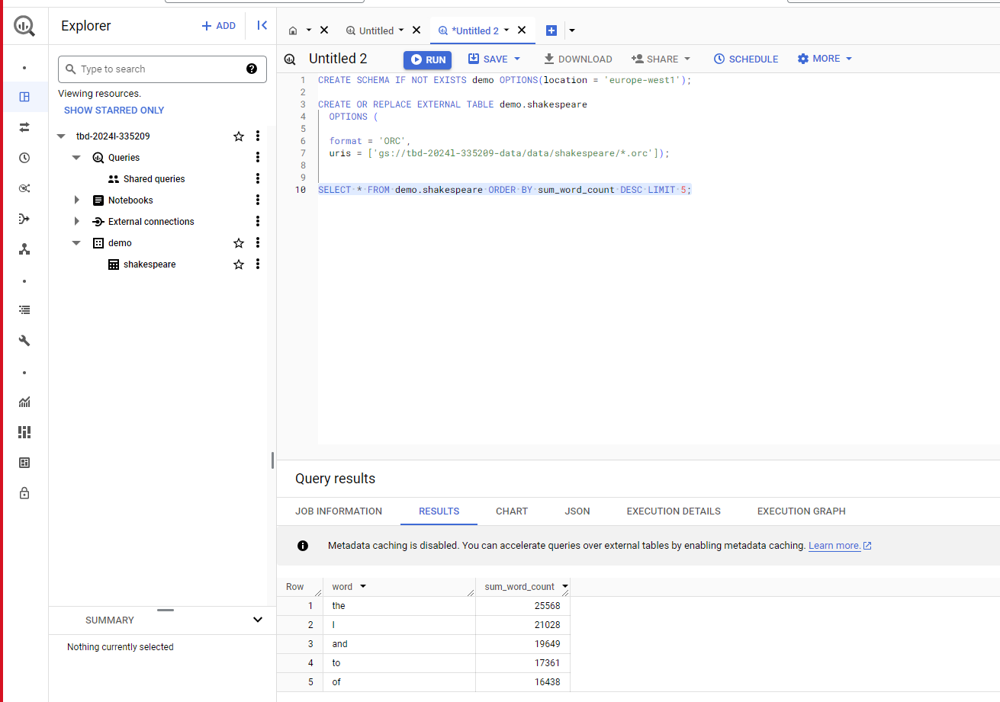
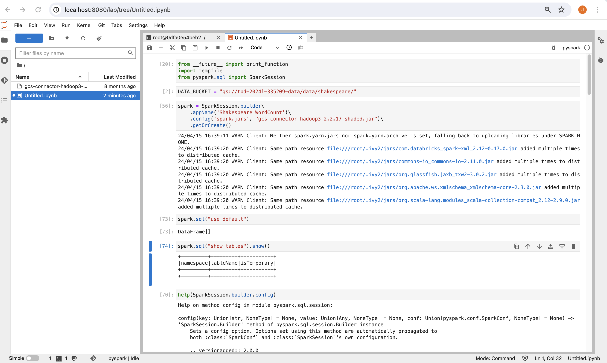
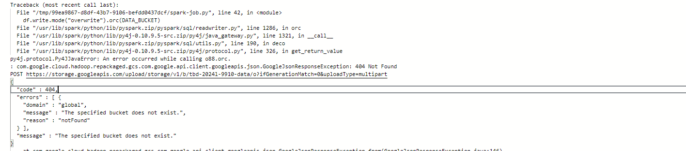
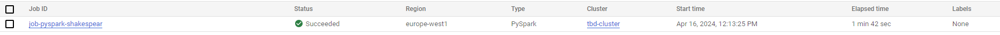

IMPORTANT ❗ ❗ ❗ Please remember to destroy all the resources after each work session. You can recreate infrastructure by creating new PR and merging it to master.
  

1. Authors:

   ***Grupa nr 8 (Jakub Dzięgielewski, Jakub Śliwa, Filip Matysik)***

   ***[link do sforkowanego repo](https://github.com/JakubDziegielewski/tbd-workshop-1)***
   
2. Follow all steps in README.md.

Przeszliśmy kroki 1-9 opisane w README.md, czego efektem było wypuszczenie pierwszego release'a. Kroki 10-11 wyszczególnione są dalej w tym pliku jako zadania 11 i 14, toteż ich wykonanie opiszemy właśnie tam.

3. Select your project and set budget alerts on 5%, 25%, 50%, 80% of 50$ (in cloud console -> billing -> budget & alerts -> create buget; unclick discounts and promotions&others while creating budget).

Stworzyliśmy budżet o nazwie TBD_gr8_budget i ustaliliśmy alerty na odpowiednich poziomach wykorzystania dostępnych środków.

5. From avaialble Github Actions select and run destroy on main branch.

Kończąc pierwszą udaną sesję pracy, poprzez GA dokonaliśmy zniszczenia aktualnej infrastruktury.

   
7. Create new git branch and:
    1. Modify tasks-phase1.md file.
    
    2. Create PR from this branch to **YOUR** master and merge it to make new release. 
    
Rozpoczynając drugą sesję pracy, zmergowaliśmy gałąź ze zmodyfikowanym plikiem tasks-phase1.md, by ponownie postawić infrastrukturę. Drugi release przeszedł pomyślnie.

8. Analyze terraform code. Play with terraform plan, terraform graph to investigate different modules.

Moduły terraforma znajdują się przede wszystkim w katalogu modules, są nimi m.in. composer, vertex-ai-workbench,  vpc czy dataproc. Przeanalizowaliśmy ten ostatni, a wynik wywołania `terraform graph` widać poniżej:

Moduł dataproc jako input przyjmuje 5 zmiennych: image_version, machine_type, project_name, region oraz subnet. W module powoływany jest Dataproc service oraz definiowany jest Dataproc cluster, zależny od tego serwisu. Cluster składa się z jednego mastera oraz dwóch worker'ów. Jako output zwracany jest dataproc_cluster_name utworzonego clustra.

9. Reach YARN UI
   
Udało nam się dotrzeć do YARN UI za pomocą dwóch komend.
Najpierw stworzyliśmy tunel ssh: `gcloud compute ssh tbd-cluster-m \   --project=tbd-2024l-335209 \   --zone=europe-west1-d -- -D 1080 -N`. 
Następnie otworzyliśmy przeglądarkę `/usr/bin/google-chrome \   --proxy-server="socks5://localhost:1080" \   --user-data-dir="/tmp/tbd-cluster-m" http://tbd-cluster-m:8088`.

   
10. Draw an architecture diagram (e.g. in draw.io) that includes:
    1. VPC topology with service assignment to subnets
    2. Description of the components of service accounts
    3. List of buckets for disposal
    4. Description of network communication (ports, why it is necessary to specify the host for the driver) of Apache Spark running from Vertex AI Workbech
  
    ***place your diagram here***

11. Create a new PR and add costs by entering the expected consumption into Infracost
For all the resources of type: `google_artifact_registry`, `google_storage_bucket`, `google_service_networking_connection`
create a sample usage profiles and add it to the Infracost task in CI/CD pipeline. Usage file [example](https://github.com/infracost/infracost/blob/master/infracost-usage-example.yml) 

   ***place the expected consumption you entered here***

   ***place the screenshot from infracost output here***

11. Create a BigQuery dataset and an external table using SQL

Udało nam się stworzyć tabelę shakespeare, jak widać na poniższym zrzucie ekranu. Powodzenie tej operacji było możliwe dopiero po naprawieniu błędu w pliku spark-job.py, gdyż dopiero sukces tego joba gwarantował dane, na podstawie których tworzona była tabela.
    

ORC nie potrzebuje schematu tabeli, ponieważ wykorzystuje podejście "schema-on-read". Polega ono na tym, że schemat jest automatycznie dedukowany lub określany w momencie odczytu danych, a nie w chwili ich zapisywania. Podejście to zwiększa elastyczność i jest szczególnie użyteczne, gdy schemat może ulegać częstym zmianom.

  
12. Start an interactive session from Vertex AI workbench:

Udało nam się rozpocząć interaktywną sesję z wykorzystaniem naszego notebook'a jupyter'owego z Vertex AI workbench za pomocą komendy `gcloud compute --project "tbd-2024l-335209" ssh --zone "europe-west1-b" "tbd-2024l-335209-notebook" -- -L 8080:localhost:8080`.

   
13. Find and correct the error in spark-job.py

W konsoli Google'a weszliśmy w logi i przeanalizowaliśmy informacje dotyczące nieudanego joba. Jak widać na zrzucie ekranu poniżej, problemem było odwoływanie się do bucketu, który nie istniał:

W momencie, gdy poprawiliśmy nazwę bucketu, job wykonał się poprawnie. Poniżej widać miejsce, w którym należało wprowadzić zmiany:

oraz dowód, że job przechodzi:

15. Additional tasks using Terraform:

    1. Add support for arbitrary machine types and worker nodes for a Dataproc cluster and JupyterLab instance

    ***place the link to the modified file and inserted terraform code***
    
    3. Add support for preemptible/spot instances in a Dataproc cluster

    ***place the link to the modified file and inserted terraform code***
    
    3. Perform additional hardening of Jupyterlab environment, i.e. disable sudo access and enable secure boot
    
    ***place the link to the modified file and inserted terraform code***

    4. (Optional) Get access to Apache Spark WebUI

    ***place the link to the modified file and inserted terraform code***
