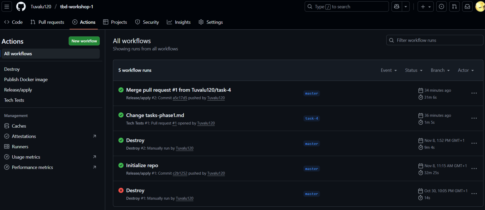
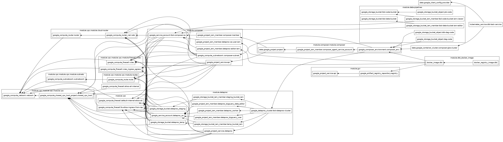
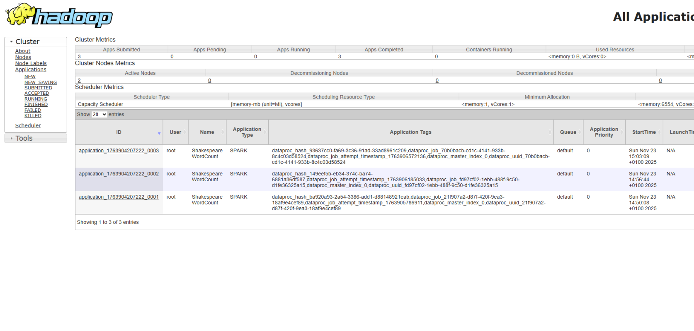
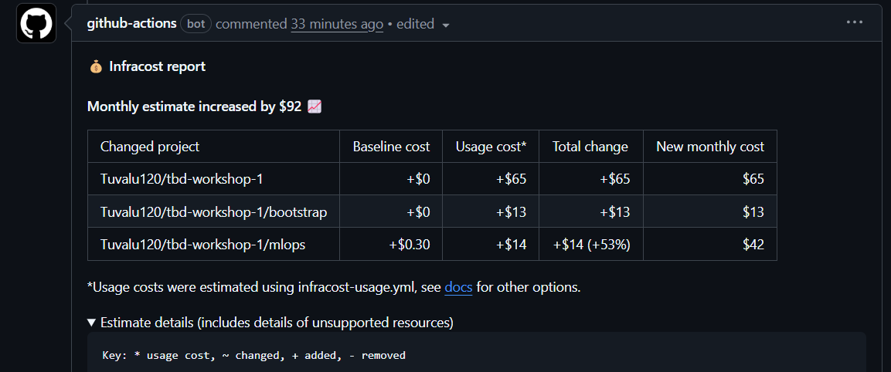

IMPORTANT ❗ ❗ ❗ Please remember to destroy all the resources after each work session. You can recreate infrastructure by creating new PR and merging it to master.

1. Authors:

   14

   https://github.com/Tuvalu120/tbd-workshop-1

2. Follow all steps in README.md.

3. From avaialble Github Actions select and run destroy on main branch.

4. Create new git branch and:
    1. Modify tasks-phase1.md file.

    2. Create PR from this branch to **YOUR** master and merge it to make new release.

    

5. Analyze terraform code. Play with terraform plan, terraform graph to investigate different modules.

    Moduł dataproc służy do stworzenia i konfiguracji klastera Apache Spark w wykorzystywanej w tym ćwiczeniu usłudze Google Cloud Dataproc. W architekturze naszego projektu pełni rolę środowiska obliczeniowego dla zadań przetwarzania danych oraz środowiska interaktywnego. Moduł ten jest ściśle powiązany z modułem sieciowym vpc (depends_on = [module.vpc]), czyli wymaga on uprzednio utworzonej sieci vpc. Zadaniami modułu jest zapewnienie, że sieć vpc jest gotowa, stworzenie klastra w określonym projekcie (project_name = var.project_name) i regionie (var.region), umieszczenie węzłów klastra w odpowiednej podsieci vpc (subnet = module.vpc.subnets[local.notebook_subnet_id].id). Dodatkowo instaluje on oprogramowanie oparte na obrazie Dataproc w wersji 2.2 z Ubuntu 22 (image_version = "2.2.69-ubuntu22") i używa maszyn wirtualnych typu e2-standard-2 (machine_type  = "e2-standard-2").

    

6. Reach YARN UI

    ~~~
    gcloud compute ssh --zone "europe-west1-b" "tbd-cluster-m" --tunnel-through-iap --project "tbd-2025z-14" -- -L 8088:localhost:8088
    ~~~

    

7. Draw an architecture diagram (e.g. in draw.io) that includes:
    1. Description of the components of service accounts
    2. List of buckets for disposal

    ***place your diagram here***

8. Create a new PR and add costs by entering the expected consumption into Infracost
For all the resources of type: `google_artifact_registry`, `google_storage_bucket`, `google_service_networking_connection`
create a sample usage profiles and add it to the Infracost task in CI/CD pipeline. Usage file [example](https://github.com/infracost/infracost/blob/master/infracost-usage-example.yml)

    

1. Create a BigQuery dataset and an external table using SQL

    ***place the code and output here***

    ORC to format plików używany do przechowywania danych w systemach Big Data. Jedną z jego głównych zalet jest to, iż pliki ORC przechowują informacje o swoim schemacie (nazwy kolumn i typy danych) wewnątrz struktury. Dzięki temu systemy takie jak BigQuery mogą odczytać plik i automatycznie odtworzyć strukturę danych, bez konieczności ręcznego definiowania schematu podczas tworzenia tabeli zewnętrznej.

2.  Find and correct the error in spark-job.py

    ***describe the cause and how to find the error***

3.  Add support for preemptible/spot instances in a Dataproc cluster

    [modules/dataproc/main.tf](modules/dataproc/main.tf)

    ~~~
    preemptible_worker_config {
      num_instances = 2
      preemptibility = "SPOT"

      disk_config {
        boot_disk_type    = "pd-standard"
        boot_disk_size_gb = 100
      }
    }
    ~~~

4.  Triggered Terraform Destroy on Schedule or After PR Merge. Goal: make sure we never forget to clean up resources and burn money.

Add a new GitHub Actions workflow that:
  1. runs terraform destroy -auto-approve
  2. triggers automatically:
 
   a) on a fixed schedule (e.g. every day at 20:00 UTC)
 
   b) when a PR is merged to main containing [CLEANUP] tag in title

Steps:
  1. Create file .github/workflows/auto-destroy.yml
  2. Configure it to authenticate and destroy Terraform resources
  3. Test the trigger (schedule or cleanup-tagged PR)

[.github/workflows/auto-destroy.yml](.github/workflows/auto-destroy.yml)

***paste screenshot/log snippet confirming the auto-destroy ran***

***write one sentence why scheduling cleanup helps in this workshop***
