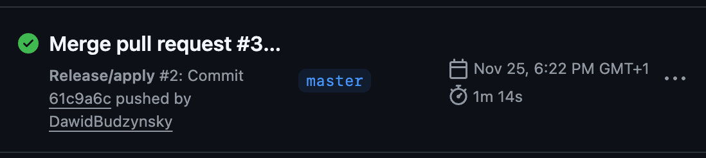
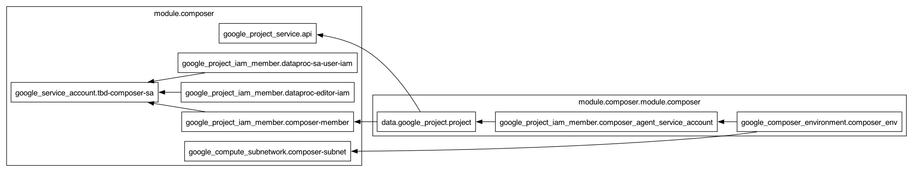
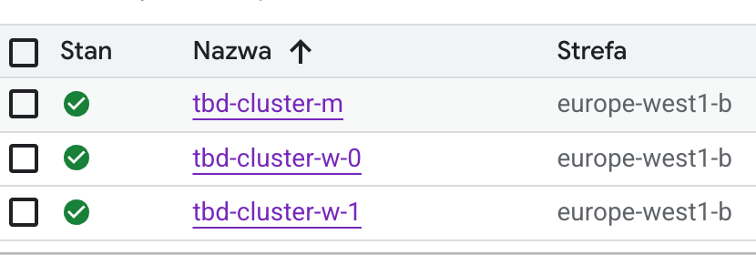
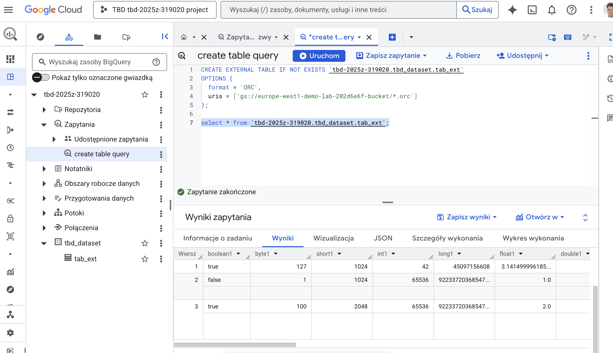

IMPORTANT ❗ ❗ ❗ Please remember to destroy all the resources after each work session. You can recreate infrastructure by creating new PR and merging it to master.
  


1. Authors:

    gr.15
    https://github.com/FilipBudzynski/tbd-workshop-1
   
2. Follow all steps in README.md.

3. From avaialble Github Actions select and run destroy on main branch.
   
4. Create new git branch and:
    1. Modify tasks-phase1.md file.
    
    2. Create PR from this branch to **YOUR** master and merge it to make new release. 
    



5. Analyze terraform code. Play with terraform plan, terraform graph to investigate different modules.

## Composer Module
The module’s main purpose is to create and configure a Cloud Composer environment along with the networking and IAM setup required for it to run. Prepares the service account, activates the Composer API, creates a subnet, and deploys the Composer environment by using defined resources. It does not manage Airflow code, DAGs, or workflows. Only manages the infrastructure needed to run Airflow.

### Inputs
Input variables for the composer module:
- env_name - Composer env name
- env_size - Environment size
- env_variables - Apache Airflow variables to set
- image_version - Defined as `composer-2.11.5-airflow-2.9.3`
- network - VPC to use for notebooks
- project_name - Project name
- region - GCP region
- subnet_address - VPC subnet used for deployment
- subnet_name - Composer subnet name

### Resources
Resources in the module:
- google_compute_subnetwork.composer-subnet – Creates a dedicated subnetwork for the Composer environment.
- google_project_iam_member.composer-member – Grants Composer service account required project permissions.
- google_project_iam_member.dataproc-editor-iam – Gives Dataproc Editor role to a member.
- google_project_iam_member.dataproc-sa-user-iam – Allows a member to act as a Dataproc service account.
- google_project_service.api – Enables required Google Cloud APIs for Composer.
- google_service_account.tbd-composer-sa – Creates the service account used by Composer.

### Outputs
- gcs_bucket - Google Cloud Storage bucket storing Apache Airflow DAGs
- data_service_account - Apache Airflow service account email
- gke_cluster - Google Kubernetes Engine cluster to run Apache Airflow components

### Diagram


   
6. Reach YARN UI
   




```bash
gcloud compute ssh tbd-cluster-m \                   255 29s py base gcloud TBD tbd-2025z-319020 project 20:45:06
  --project=tbd-2025z-319020 \
  --zone=europe-west1-b \
  -- -L 8088:localhost:8088
```
   
7. Draw an architecture diagram (e.g. in draw.io) that includes:
    1. Description of the components of service accounts
    2. List of buckets for disposal
    
    ***place your diagram here***

8. Create a new PR and add costs by entering the expected consumption into Infracost
For all the resources of type: `google_artifact_registry`, `google_storage_bucket`, `google_service_networking_connection`
create a sample usage profiles and add it to the Infracost task in CI/CD pipeline. Usage file [example](https://github.com/infracost/infracost/blob/master/infracost-usage-example.yml) 

   ***place the expected consumption you entered here***

   ***place the screenshot from infracost output here***

9. Create a BigQuery dataset and an external table using SQL
    
    Two ORC files were downloaded:
    1. https://github.com/apache/orc/blob/main/examples/TestOrcFile.metaData.orc
    2. https://github.com/apache/orc/blob/main/examples/TestOrcFile.test1.orc

    code used in BigQuery studio:

    ```sql
    CREATE SCHEMA IF NOT EXISTS `tbd-2025z-319020.tbd_dataset`
    OPTIONS (
    location = 'europe-west1'
    );
    ```

    Code for file no.1 :
    ```sql
    CREATE EXTERNAL TABLE IF NOT EXISTS `tbd-2025z-319020.tbd_dataset.tab_ext`
    OPTIONS (
    format = 'ORC',
    uris = ['gs://europe-west1-demo-lab-202d6e6f-bucket/*.orc']
    );
    ```

    code for file no.2 :
    ```sql
    CREATE EXTERNAL TABLE IF NOT EXISTS `tbd-2025z-319020.tbd_dataset.testing`
    OPTIONS (
    format = 'ORC',
    uris = ['gs://europe-west1-demo-lab-202d6e6f-bucket/test_data/*.orc']
    );
    ```

    Output:
    

   
    ***why does ORC not require a table schema?***

    ORC files are self-describing. Entire schema with column names and types is stored in the file's metadata. Because of this type of storage, external table definition is not required to read the file's contents. External table definition is only to define the table structure.
    The embedded schema allows readers to correctly interpret the data even if the external table definition changes over time.


10. Find and correct the error in spark-job.py

    ***describe the cause and how to find the error***

11. Add support for preemptible/spot instances in a Dataproc cluster

    ***place the link to the modified file and inserted terraform code***
    
12. Triggered Terraform Destroy on Schedule or After PR Merge. Goal: make sure we never forget to clean up resources and burn money.

Add a new GitHub Actions workflow that:
  1. runs terraform destroy -auto-approve
  2. triggers automatically:
   
   a) on a fixed schedule (e.g. every day at 20:00 UTC)
   
   b) when a PR is merged to main containing [CLEANUP] tag in title

Steps:
  1. Create file .github/workflows/auto-destroy.yml
  2. Configure it to authenticate and destroy Terraform resources
  3. Test the trigger (schedule or cleanup-tagged PR)
     
***paste workflow YAML here***

***paste screenshot/log snippet confirming the auto-destroy ran***

***write one sentence why scheduling cleanup helps in this workshop***
