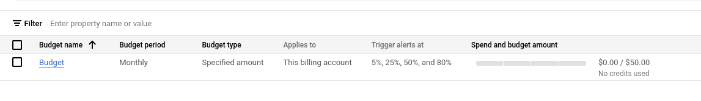
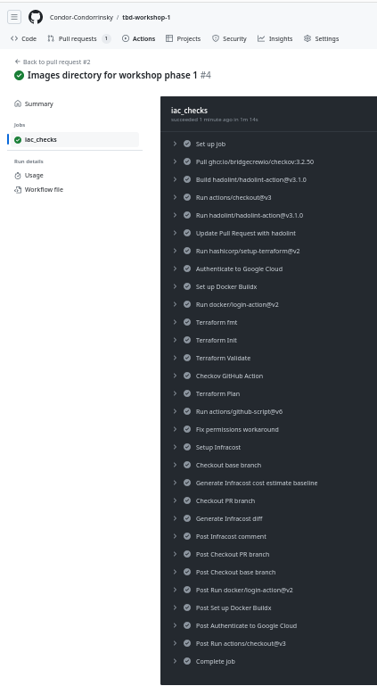
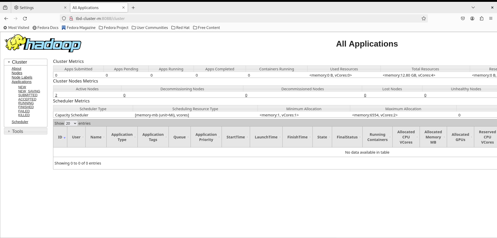
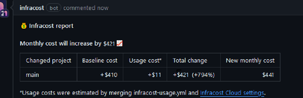
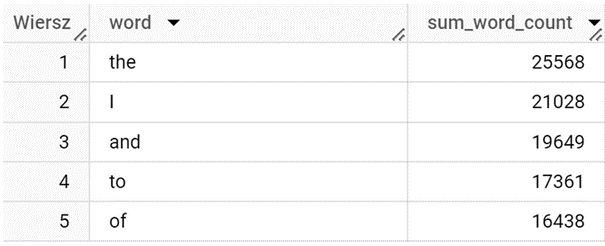
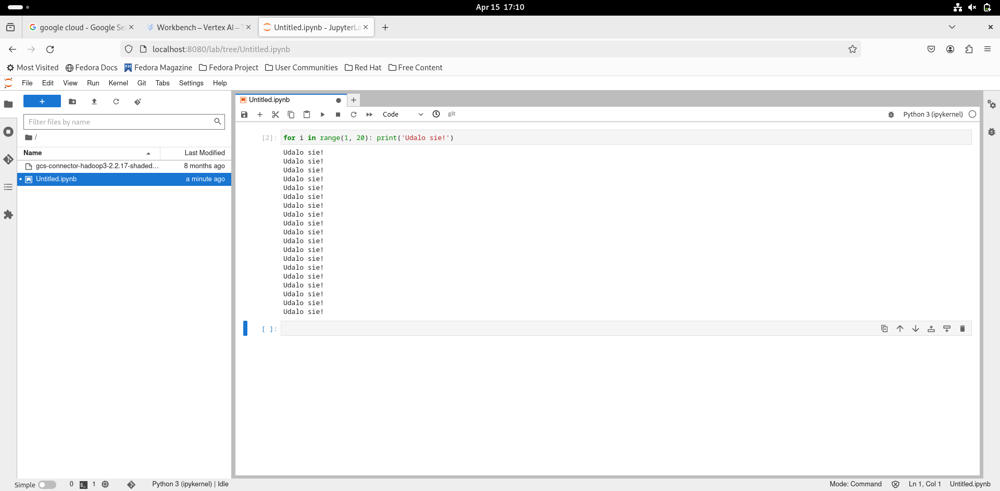

IMPORTANT ❗ ❗ ❗ Please remember to destroy all the resources after each work session. You can recreate infrastructure by creating new PR and merging it to master.
  


1. Authors:

Grupa nr 2 w skladzie:
    - Dumin Konrad 310974
    - Kiernozek Jakub 304503

Repozytorium nalezy do Konrada:
https://github.com/Condor-Condorrinsky/tbd-workshop-1
   
2. Follow all steps in README.md.

3. Select your project and set budget alerts on 5%, 25%, 50%, 80% of 50$ (in cloud console -> billing -> budget & alerts -> create buget; unclick discounts and promotions&others while creating budget).

  

Ustalony budzet:
    

5. From avaialble Github Actions select and run destroy on main branch.
   
7. Create new git branch and:
    1. Modify tasks-phase1.md file.
    
    2. Create PR from this branch to **YOUR** master and merge it to make new release. 
    
    

8. Analyze terraform code. Play with terraform plan, terraform graph to investigate different modules.

Modul vertex_ai_workbench sluzy do zalozenia zeszytu JuPyter do uczenia maszynowego o tytule takim samym, jak tytul projektu z dopiskiem "notebook". Zeszyt zostanie zalozony w lokacji "europe_west_1". Zostanie tez stworzona rola "token_creator_role". Zostanie rowniez zalozony specjalny bycket dla zeszytu, a takze dedykowany binding oraz dodatkowy job "post-startup".

Graf modulu vertex_ai_workbench:

```
fedora@fedora:~/tbd-workshop-1/modules/vertex-ai-workbench$ terraform graph
digraph {
	compound = "true"
	newrank = "true"
	subgraph "root" {
		"[root] data.google_project.project (expand)" [label = "data.google_project.project", shape = "box"]
		"[root] google_notebooks_instance.tbd_notebook (expand)" [label = "google_notebooks_instance.tbd_notebook", shape = "box"]
		"[root] google_project_iam_binding.token_creator_role (expand)" [label = "google_project_iam_binding.token_creator_role", shape = "box"]
		"[root] google_project_service.notebooks (expand)" [label = "google_project_service.notebooks", shape = "box"]
		"[root] google_storage_bucket.notebook-conf-bucket (expand)" [label = "google_storage_bucket.notebook-conf-bucket", shape = "box"]
		"[root] google_storage_bucket_iam_binding.binding (expand)" [label = "google_storage_bucket_iam_binding.binding", shape = "box"]
		"[root] google_storage_bucket_object.post-startup (expand)" [label = "google_storage_bucket_object.post-startup", shape = "box"]
		"[root] provider[\"registry.terraform.io/hashicorp/google\"]" [label = "provider[\"registry.terraform.io/hashicorp/google\"]", shape = "diamond"]
		"[root] var.ai_notebook_image_repository" [label = "var.ai_notebook_image_repository", shape = "note"]
		"[root] var.ai_notebook_image_tag" [label = "var.ai_notebook_image_tag", shape = "note"]
		"[root] var.ai_notebook_instance_owner" [label = "var.ai_notebook_instance_owner", shape = "note"]
		"[root] var.network" [label = "var.network", shape = "note"]
		"[root] var.project_name" [label = "var.project_name", shape = "note"]
		"[root] var.region" [label = "var.region", shape = "note"]
		"[root] var.subnet" [label = "var.subnet", shape = "note"]
		"[root] data.google_project.project (expand)" -> "[root] provider[\"registry.terraform.io/hashicorp/google\"]"
		"[root] data.google_project.project (expand)" -> "[root] var.project_name"
		"[root] google_notebooks_instance.tbd_notebook (expand)" -> "[root] google_project_service.notebooks (expand)"
		"[root] google_notebooks_instance.tbd_notebook (expand)" -> "[root] google_storage_bucket_object.post-startup (expand)"
		"[root] google_notebooks_instance.tbd_notebook (expand)" -> "[root] local.zone (expand)"
		"[root] google_notebooks_instance.tbd_notebook (expand)" -> "[root] var.ai_notebook_image_repository"
		"[root] google_notebooks_instance.tbd_notebook (expand)" -> "[root] var.ai_notebook_image_tag"
		"[root] google_notebooks_instance.tbd_notebook (expand)" -> "[root] var.ai_notebook_instance_owner"
		"[root] google_notebooks_instance.tbd_notebook (expand)" -> "[root] var.network"
		"[root] google_notebooks_instance.tbd_notebook (expand)" -> "[root] var.subnet"
		"[root] google_project_iam_binding.token_creator_role (expand)" -> "[root] local.gce_service_account (expand)"
		"[root] google_project_service.notebooks (expand)" -> "[root] provider[\"registry.terraform.io/hashicorp/google\"]"
		"[root] google_storage_bucket.notebook-conf-bucket (expand)" -> "[root] provider[\"registry.terraform.io/hashicorp/google\"]"
		"[root] google_storage_bucket.notebook-conf-bucket (expand)" -> "[root] var.project_name"
		"[root] google_storage_bucket.notebook-conf-bucket (expand)" -> "[root] var.region"
		"[root] google_storage_bucket_iam_binding.binding (expand)" -> "[root] google_storage_bucket.notebook-conf-bucket (expand)"
		"[root] google_storage_bucket_iam_binding.binding (expand)" -> "[root] local.gce_service_account (expand)"
		"[root] google_storage_bucket_object.post-startup (expand)" -> "[root] google_storage_bucket.notebook-conf-bucket (expand)"
		"[root] local.gce_service_account (expand)" -> "[root] data.google_project.project (expand)"
		"[root] local.zone (expand)" -> "[root] var.region"
		"[root] provider[\"registry.terraform.io/hashicorp/google\"] (close)" -> "[root] google_notebooks_instance.tbd_notebook (expand)"
		"[root] provider[\"registry.terraform.io/hashicorp/google\"] (close)" -> "[root] google_project_iam_binding.token_creator_role (expand)"
		"[root] provider[\"registry.terraform.io/hashicorp/google\"] (close)" -> "[root] google_storage_bucket_iam_binding.binding (expand)"
		"[root] root" -> "[root] provider[\"registry.terraform.io/hashicorp/google\"] (close)"
	}
}
```
   
9. Reach YARN UI
   
   ```
    export PROJECT=tbd-2024l-310974
    export HOSTNAME=tbd-cluster-m
    export ZONE=europe-west1-d
    export PORT=1080
    gcloud compute ssh ${HOSTNAME} --project=${PROJECT} --zone=${ZONE} -- -D ${PORT} -N
	```

    
   
10. Draw an architecture diagram (e.g. in draw.io) that includes:
    1. VPC topology with service assignment to subnets
    2. Description of the components of service accounts
    3. List of buckets for disposal
    4. Description of network communication (ports, why it is necessary to specify the host for the driver) of Apache Spark running from Vertex AI Workbech
  
	Plik jest duzy, moze nie wczytywac sie poprawnie
    

11. Create a new PR and add costs by entering the expected consumption into Infracost
For all the resources of type: `google_artifact_registry`, `google_storage_bucket`, `google_service_networking_connection`
create a sample usage profiles and add it to the Infracost task in CI/CD pipeline. Usage file [example](https://github.com/infracost/infracost/blob/master/infracost-usage-example.yml) 

    Dodane przewidywane koszta:
    ```
	google_artifact_registry_repository.registry:
 	storage_gb: 150
 	monthly_egress_data_transfer_gb:
   	europe_west1: 100
   	us_central1: 50
   	asia_east1: 20

	google_storage_bucket.tbd-state-bucket:
 	storage_gb: 150
 	monthly_class_a_operations: 40000
 	monthly_class_b_operations: 20000
 	monthly_data_retrieval_gb: 500
 	monthly_egress_data_transfer_gb:
   	same_continent: 550
   	worldwide: 12500
   	asia: 1500
   	china: 50
   	australia: 250

	google_storage_bucket.tbd-code-bucket:
 	storage_gb: 200
 	monthly_class_a_operations: 50000
 	monthly_class_b_operations: 25000
 	monthly_data_retrieval_gb: 750
 	monthly_egress_data_transfer_gb:
   	same_continent: 600
   	worldwide: 13000
   	asia: 1600
   	china: 100
   	australia: 300

	google_storage_bucket.tbd-data-bucket:
 	storage_gb: 250
 	monthly_class_a_operations: 45000
 	monthly_class_b_operations: 30000
 	monthly_data_retrieval_gb: 1000
 	monthly_egress_data_transfer_gb:
   	same_continent: 500
   	worldwide: 12000
   	asia: 1400
   	china: 75
   	australia: 275

	google_storage_bucket.notebook-conf-bucket:
 	storage_gb: 180
 	monthly_class_a_operations: 42000
 	monthly_class_b_operations: 22000
 	monthly_data_retrieval_gb: 550
 	monthly_egress_data_transfer_gb:
   	same_continent: 580
   	worldwide: 12300
   	asia: 1550
   	china: 60
   	australia: 260

	google_storage_bucket.mlflow_artifacts_bucket:
 	storage_gb: 160
 	monthly_class_a_operations: 38000
 	monthly_class_b_operations: 21000
 	monthly_data_retrieval_gb: 600
 	monthly_egress_data_transfer_gb:
   	same_continent: 560
   	worldwide: 12700
   	asia: 1500
   	china: 55
   	australia: 250

	google_service_networking_connection.private_vpc_connection:
 	monthly_egress_data_transfer_gb:
   	same_region: 250
   	us_or_canada: 100
   	europe: 70
   	asia: 50
   	south_america: 100
   	oceania: 50
   	worldwide: 250
    ```
	
	

11. Create a BigQuery dataset and an external table using SQL
    
	CREATE SCHEMA IF NOT EXISTS demo OPTIONS(location = 'europe-west1');
	CREATE OR REPLACE EXTERNAL TABLE demo.shakespeare
  		OPTIONS (
  		format = 'ORC',
  		uris = ['gs://tbd-2024l-304503-data/data/shakespeare/*.orc']);
	SELECT * FROM demo.shakespeare ORDER BY sum_word_count DESC LIMIT 5;

	
   
	Tabele w formacie ORC sa *dataframe'ami* w sensie Python'owym (Spark, biblioteka *pandas* etc.) i zawieraja juz w sobie *table schema* "out-of-the-box".

	https://stackoverflow.com/questions/39467068/create-hive-table-from-orc-file-without-specifying-schema
  
12. Start an interactive session from Vertex AI workbench:

    
   
13. Find and correct the error in spark-job.py

	Nalezalo zmienic jedna linijke:

	```
	DATA_BUCKET = "gs://tbd-2024l-9910-data/data/shakespeare/"
	
	--->

	DATA_BUCKET = "gs://tbd-2024l-310974-data/data/shakespeare/"
	```

	Problem byl tej natury, ze zasob, o ktory odpytywal sie spark zwyczajnie nie istnial pod dana sciezka,
	dlatego kod nie mogl sie poprawnie wykonac.

14. Additional tasks using Terraform:

    1. Add support for arbitrary machine types and worker nodes for a Dataproc cluster and JupyterLab instance

	```
      master_config {
        num_instances = 1
        machine_type  = var.machine_type
        # Custom machine support - commented out since we don't need that much processing power and it would burn credits too fast
        # machine_type = "custom-16-92160"
        disk_config {
          boot_disk_type    = "pd-standard"
          boot_disk_size_gb = 100
        }
      }
	```
    
    2. Add support for preemptible/spot instances in a Dataproc cluster

    Kod do dodania maszyn typu *preemptible*:

	```
	preemptible_worker_config {
      num_instances = 0
    } (domyslnie tworzymy zero, beda dodawane w razie potrzeby)
	```

	https://github.com/Condor-Condorrinsky/tbd-workshop-1/blob/master/modules/dataproc/main.tf
    
    3. Perform additional hardening of Jupyterlab environment, i.e. disable sudo access and enable secure boot

	Kod do wylaczenia dostepu do sudo:
	```
	metadata = {
    	vmDnsSetting : "GlobalDefault"
    	notebook-disable-root = true
  }
	```

	Kod do uruchomienia Secure Boot:
	```
	shielded_instance_config {
    	enable_secure_boot = true
  	}
	```

	Zmodyfikowany plik:
	https://github.com/Condor-Condorrinsky/tbd-workshop-1/blob/master/modules/vertex-ai-workbench/main.tf
	(resource "google_notebooks_instance" "tbd_notebook")

    4. (Optional) Get access to Apache Spark WebUI

    ***place the link to the modified file and inserted terraform code***
