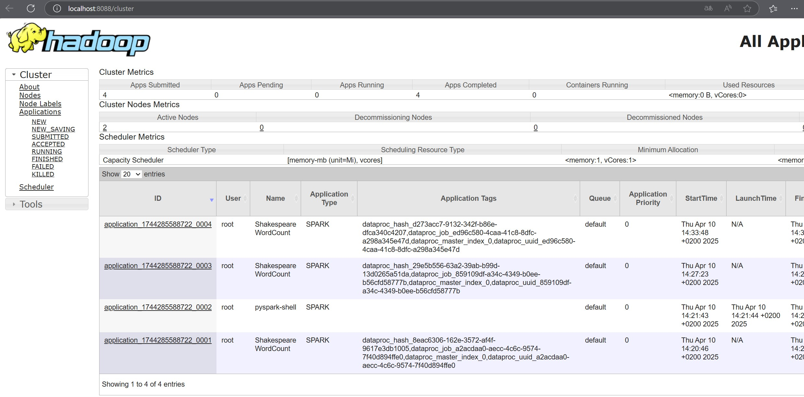
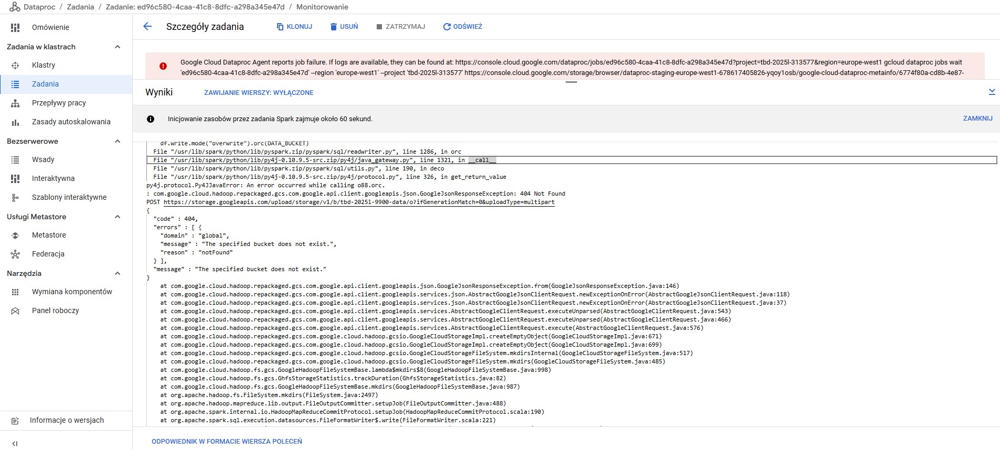

IMPORTANT ❗ ❗ ❗ Please remember to destroy all the resources after each work session. You can recreate infrastructure by creating new PR and merging it to master.
  


1. Authors:

   13

   https://github.com/TheStm/tbd-workshop-1
   
2. Follow all steps in README.md.

3. In boostrap/variables.tf add your emails to variable "budget_channels".

4. From avaialble Github Actions select and run destroy on main branch.
   
5. Create new git branch and:
    1. Modify tasks-phase1.md file.
    
    2. Create PR from this branch to **YOUR** master and merge it to make new release. 
    
    ***place the screenshot from GA after succesfull application of release***


6. Analyze terraform code. Play with terraform plan, terraform graph to investigate different modules.

W ramach analizy wybrany został moduł `vpc`, odpowiedzialny za utworzenie podstawowej infrastruktury sieciowej w 
projekcie GCP.

Zasoby tworzone przez ten moduł to:
- `google_compute_network.network` – główna sieć VPC.
- `google_compute_subnetwork.subnetwork` – jedna lub więcej podsieci (moduł `subnets`).
- `google_compute_firewall.rules` – reguły firewalla dla ruchu przychodzącego i wychodzącego (`module.firewall_rules`).
- `google_compute_firewall.default-internal-allow-all` – domyślna reguła dopuszczająca ruch wewnątrz sieci.
- `google_compute_firewall.fw-allow-ingress-from-iap` – pozwala na dostęp z IAP (Identity-Aware Proxy).
- `google_compute_shared_vpc_host_project.shared_vpc_host` – ustawia projekt jako host dla Shared VPC.
- `google_compute_router.router` + `google_compute_router_nat.nats` – umożliwiają dostęp do internetu dla zasobów bez zewnętrznych IP (moduł `cloud-router`).
- `google_compute_route.route` – niestandardowe trasy (moduł `routes`).

Zależności w tym module przedstawia poniższy graf:


7. Reach YARN UI
    
Tunel ustawiono przy urzyciu komendy:
```
bash gcloud compute ssh cluster-tbd1-m \ 
--project=tbd-2025l-313577 \ 
--zone=europe-west1-b \ 
-- -L 8088:localhost:8088 
```



8. Draw an architecture diagram (e.g. in draw.io) that includes:
    1. VPC topology with service assignment to subnets
    2. Description of the components of service accounts
    3. List of buckets for disposal
    4. Description of network communication (ports, why it is necessary to specify the host for the driver) of Apache Spark running from Vertex AI Workbech
  
    ***place your diagram here***

9. Create a new PR and add costs by entering the expected consumption into Infracost
For all the resources of type: `google_artifact_registry`, `google_storage_bucket`, `google_service_networking_connection`
create a sample usage profiles and add it to the Infracost task in CI/CD pipeline. Usage file [example](https://github.com/infracost/infracost/blob/master/infracost-usage-example.yml) 

   ***place the expected consumption you entered here***

   ***place the screenshot from infracost output here***

10. Create a BigQuery dataset and an external table using SQL
    
    ***place the code and output here***
   
    ***why does ORC not require a table schema?***

11. Find and correct the error in spark-job.py

Znaleziono błąd w logach tego joba:



Widnieje tutaj informacja, że "Specified bucket does not exist". Należało 
poprawić nazwę bucketa w pliku `spark-job.py`.

12. Add support for preemptible/spot instances in a Dataproc cluster

    ***place the link to the modified file and inserted terraform code***
    
    
