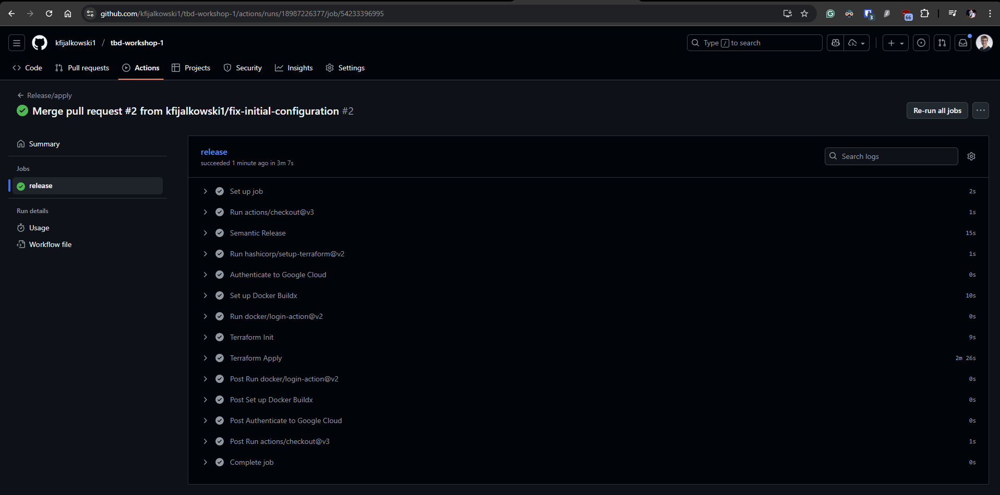

IMPORTANT ❗ ❗ ❗ Please remember to destroy all the resources after each work session. You can recreate infrastructure by creating new PR and merging it to master.
  


1. Authors:

   gr.2

   https://github.com/kfijalkowski1/tbd-workshop-1

   
   
2. Follow all steps in README.md.

3. From avaialble Github Actions select and run destroy on main branch.
   
4. Create new git branch and:
    1. Modify tasks-phase1.md file.
    
    2. Create PR from this branch to **YOUR** master and merge it to make new release. 
    
    

    First release failed due to Github Actions timeout.


5. Analyze terraform code. Play with terraform plan, terraform graph to investigate different modules.

    
    ## Composer module description
    - Creates service account for composer and gives it:
        - `composer-member` [composer.worker](https://docs.cloud.google.com/composer/docs/composer-3/access-control#composer.worker) role
        - `dataproc-editor-iam` [dataproc.editor](https://docs.cloud.google.com/dataproc/docs/concepts/iam/iam#dataproc.editor) role
        - `dataproc-sa-user-iam` [iam.serviceAccountUser](https://docs.cloud.google.com/iam/docs/service-account-permissions) role
    - Enables `composer.googleapis.com` - a fully managed workflow orchestration service from Google Cloud that is built on Apache Airflow
    - Creates subnet with logs enabled to be aggregated every 10 minutes
    - Creates Cloud Composer V2 (Apache Airflow) environment based on `terraform-google-modules/composer/google//modules/create_environment_v2`
    - Outputs:
        - GCS bucket for storing Apache Airflow DAGs
        - Apache Airflow service account
        - Composer underlying GKE cluster
    
    ## Composer module graph
    ```
    digraph G {
        rankdir = "RL";
        node [shape = rect, fontname = "sans-serif"];
        "google_compute_subnetwork.composer-subnet" [label="google_compute_subnetwork.composer-subnet"];
        "google_project_iam_member.composer-member" [label="google_project_iam_member.composer-member"];
        "google_project_iam_member.dataproc-editor-iam" [label="google_project_iam_member.dataproc-editor-iam"];
        "google_project_iam_member.dataproc-sa-user-iam" [label="google_project_iam_member.dataproc-sa-user-iam"];
        "google_project_service.api" [label="google_project_service.api"];
        "google_service_account.tbd-composer-sa" [label="google_service_account.tbd-composer-sa"];
        subgraph "cluster_module.composer" {
            label = "module.composer"
            fontname = "sans-serif"
            "module.composer.data.google_project.project" [label="data.google_project.project"];
            "module.composer.google_composer_environment.composer_env" [label="google_composer_environment.composer_env"];
            "module.composer.google_project_iam_member.composer_agent_service_account" [label="google_project_iam_member.composer_agent_service_account"];
        }
        "google_project_iam_member.composer-member" -> "google_service_account.tbd-composer-sa";
        "google_project_iam_member.dataproc-editor-iam" -> "google_service_account.tbd-composer-sa";
        "google_project_iam_member.dataproc-sa-user-iam" -> "google_service_account.tbd-composer-sa";
        "module.composer.data.google_project.project" -> "google_project_iam_member.composer-member";
        "module.composer.data.google_project.project" -> "google_project_service.api";
        "module.composer.google_composer_environment.composer_env" -> "google_compute_subnetwork.composer-subnet";
        "module.composer.google_composer_environment.composer_env" -> "module.composer.google_project_iam_member.composer_agent_service_account";
        "module.composer.google_project_iam_member.composer_agent_service_account" -> "module.composer.data.google_project.project";
    }
    ```


    ***describe one selected module and put the output of terraform graph for this module here***
   
6. Reach YARN UI
   
command to open SOCKS proxy
```
gcloud compute ssh tbd-cluster-m \
  --project=tbd-2025z-318652 \
  --zone=europe-west1-d -- -D 1080 -N
```

Command to open browser with proxy setup
```
"/Applications/Google Chrome.app/Contents/MacOS/Google Chrome" \
  --proxy-server="socks5://localhost:1080" \
  --user-data-dir="/tmp/tbd-cluster-m" http://tbd-cluster-m:8088/
```
Opened YARN UI


Or run:
```
gcloud compute ssh tbd-cluster-m \
  --project=tbd-2025z-318652 \
  --zone=europe-west1-d -- -D 1080 -N
```

and open in browser: http://127.0.0.1:1080/cluster

   
7. Draw an architecture diagram (e.g. in draw.io) that includes:
    1. Description of the components of service accounts
    2. List of buckets for disposal
    
    ***place your diagram here***

8. Create a new PR and add costs by entering the expected consumption into Infracost
For all the resources of type: `google_artifact_registry`, `google_storage_bucket`, `google_service_networking_connection`
create a sample usage profiles and add it to the Infracost task in CI/CD pipeline. Usage file [example](https://github.com/infracost/infracost/blob/master/infracost-usage-example.yml) 

  google_artifact_registry_repository.my_artifact_registry:
    storage_gb: 50 # Total data stored in the repository in GB
    monthly_egress_data_transfer_gb:
      europe_west1: 50

  google_service_networking_connection.my_connection:
    monthly_egress_data_transfer_gb: # Monthly VM-VM data transfer from VPN gateway to the following, in GB:
      same_region: 0                # VMs in the same Google Cloud region.
      us_or_canada: 0               # From a Google Cloud region in the US or Canada to another Google Cloud region in the US or Canada.
      europe: 15                      # Between Google Cloud regions within Europe.
      asia: 0                        # Between Google Cloud regions within Asia.
      south_america: 0              # Between Google Cloud regions within South America.
      oceania: 0                     # Indonesia and Oceania to/from any Google Cloud region.
      worldwide: 0                  # to a Google Cloud region on another continent.

  google_storage_bucket.my_storage_bucket:
    storage_gb: 50                   # Total size of bucket in GB.
    monthly_class_a_operations: 10000 # Monthly number of class A operations (object adds, bucket/object list).
    monthly_class_b_operations: 10000 # Monthly number of class B operations (object gets, retrieve bucket/object metadata).
    monthly_data_retrieval_gb: 100    # Monthly amount of data retrieved in GB.
    monthly_egress_data_transfer_gb:  # Monthly data transfer from Cloud Storage to the following, in GB:
      same_continent: 100  # Same continent.
      worldwide: 0     # Worldwide excluding Asia, Australia.
      asia: 0           # Asia excluding China, but including Hong Kong.
      china: 0            # China excluding Hong Kong.
      australia: 0       # Australia.

   ***place the screenshot from infracost output here***

9. Create a BigQuery dataset and an external table using SQL
    
    ***place the code and output here***
   
    ***why does ORC not require a table schema?***

10. Find and correct the error in spark-job.py

    ***describe the cause and how to find the error***

11. Add support for preemptible/spot instances in a Dataproc cluster

    ***place the link to the modified file and inserted terraform code***
    
12. Triggered Terraform Destroy on Schedule or After PR Merge. Goal: make sure we never forget to clean up resources and burn money.

Add a new GitHub Actions workflow that:
  1. runs terraform destroy -auto-approve
  2. triggers automatically:
   
   a) on a fixed schedule (e.g. every day at 20:00 UTC)
   
   b) when a PR is merged to main containing [CLEANUP] tag in title

Steps:
  1. Create file .github/workflows/auto-destroy.yml
  2. Configure it to authenticate and destroy Terraform resources
  3. Test the trigger (schedule or cleanup-tagged PR)
     
***paste workflow YAML here***

***paste screenshot/log snippet confirming the auto-destroy ran***

***write one sentence why scheduling cleanup helps in this workshop***
