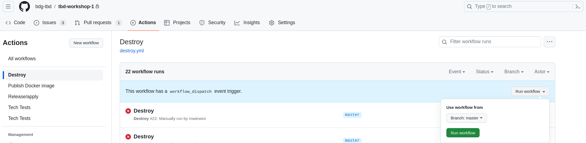
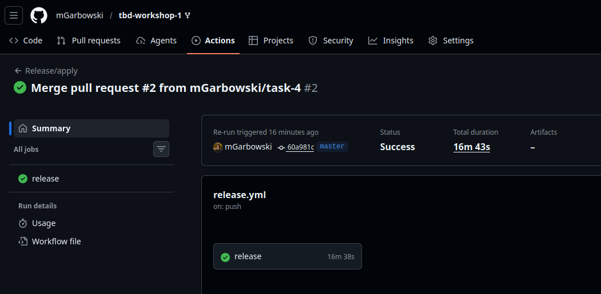
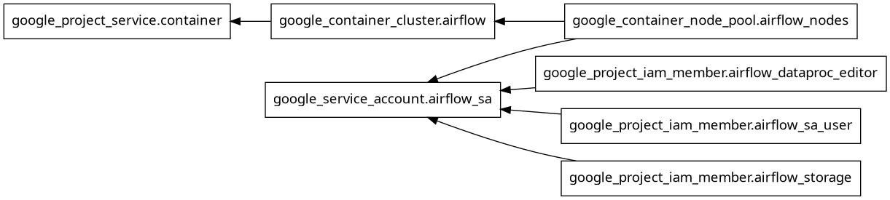
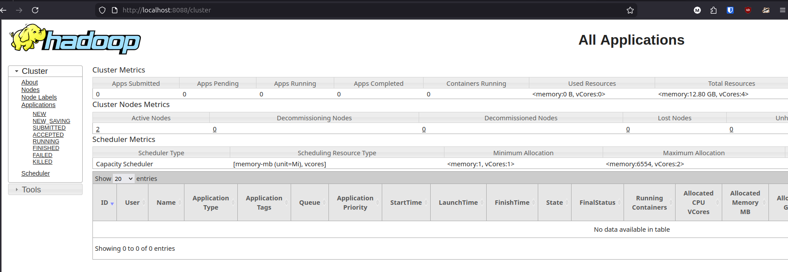
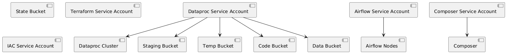
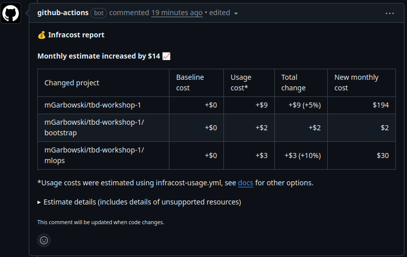
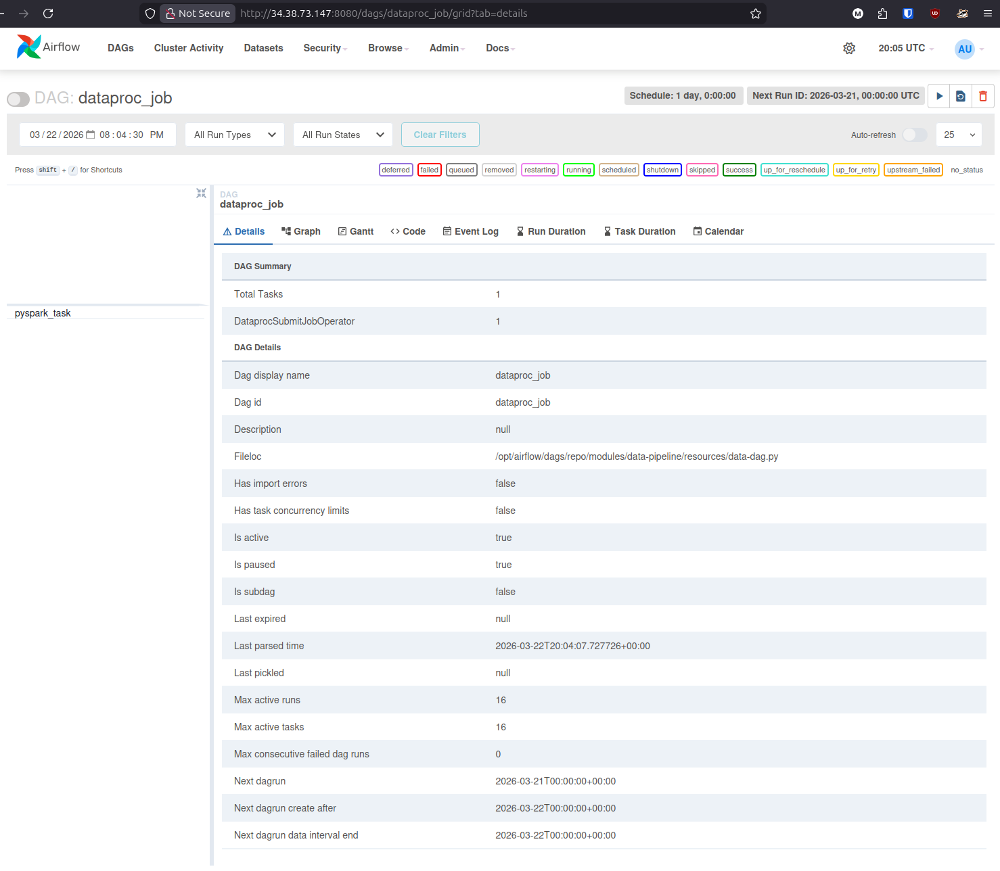
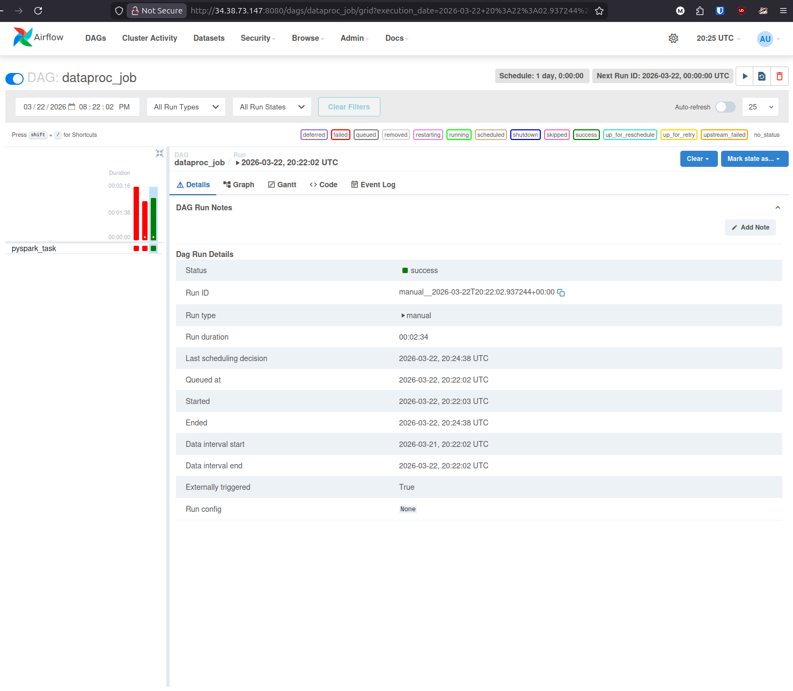

IMPORTANT ❗ ❗ ❗ Please remember to destroy all the resources after each work session. You can recreate infrastructure by creating new PR and merging it to master.


                                                                                                                                                                                                                                                                                                                                                                                  
## Phase 1 Exercise Overview

  ```mermaid
  flowchart TD
      A[🔧 Step 0: Fork repository] --> B[🔧 Step 1: Environment variables\nexport TF_VAR_*]
      B --> C[🔧 Step 2: Bootstrap\nterraform init/apply\n→ GCP project + state bucket]
      C --> D[🔧 Step 3: Quota increase\nCPUS_ALL_REGIONS ≥ 24]
      D --> E[🔧 Step 4: CI/CD Bootstrap\nWorkload Identity Federation\n→ keyless auth GH→GCP]
      E --> F[🔧 Step 5: GitHub Secrets\nGCP_WORKLOAD_IDENTITY_*\nINFRACOST_API_KEY]
      F --> G[🔧 Step 6: pre-commit install]
      G --> H[🔧 Step 7: Push + PR + Merge\n→ release workflow\n→ terraform apply]

      H --> I{Infrastructure\nrunning on GCP}

      I --> J[📋 Task 3: Destroy\nGitHub Actions → workflow_dispatch]
      I --> K[📋 Task 4: New branch\nModify tasks-phase1.md\nPR → merge → new release]
      I --> L[📋 Task 5: Analyze Terraform\nterraform plan/graph\nDescribe selected module]
      I --> M[📋 Task 6: YARN UI\ngcloud compute ssh\nIAP tunnel → port 8088]
      I --> N[📋 Task 7: Architecture diagram\nService accounts + buckets]
      I --> O[📋 Task 8: Infracost\nUsage profiles for\nartifact_registry + storage_bucket]
      I --> P[📋 Task 9: Spark job fix\nAirflow UI → DAG → debug\nFix spark-job.py]
      I --> Q[📋 Task 10: BigQuery\nDataset + external table\non ORC files]
      I --> R[📋 Task 11: Spot instances\npreemptible_worker_config\nin Dataproc module]
      I --> S[📋 Task 12: Auto-destroy\nNew GH Actions workflow\nschedule + cleanup tag]

      style A fill:#4a9eff,color:#fff
      style B fill:#4a9eff,color:#fff
      style C fill:#4a9eff,color:#fff
      style D fill:#ff9f43,color:#fff
      style E fill:#4a9eff,color:#fff
      style F fill:#ff9f43,color:#fff
      style G fill:#4a9eff,color:#fff
      style H fill:#4a9eff,color:#fff
      style I fill:#2ed573,color:#fff
      style J fill:#a55eea,color:#fff
      style K fill:#a55eea,color:#fff
      style L fill:#a55eea,color:#fff
      style M fill:#a55eea,color:#fff
      style N fill:#a55eea,color:#fff
      style O fill:#a55eea,color:#fff
      style P fill:#a55eea,color:#fff
      style Q fill:#a55eea,color:#fff
      style R fill:#a55eea,color:#fff
      style S fill:#a55eea,color:#fff
```

  Legend

  - 🔵 Blue — setup steps (one-time configuration)
  - 🟠 Orange — manual steps (GCP Console / GitHub UI)
  - 🟢 Green — infrastructure ready
  - 🟣 Purple — tasks to complete and document in tasks-phase1.md

1. Authors:

   Group z4

   https://github.com/mGarbowski/tbd-workshop-1

2. Follow all steps in README.md.

3. From available Github Actions select and run destroy on master branch.

4. Create new git branch and:
    1. Modify tasks-phase1.md file.

    2. Create PR from this branch to **YOUR** master and merge it to make new release.

    


5. Analyze terraform code. Play with terraform plan, terraform graph to investigate different modules.

    Module [airflow](./modules/airflow/) configures an account with IAM roles and configures a Kubernetes cluster with 2 nodes where Airflow will be deployed

    

6. Reach YARN UI

   Hint: the Dataproc cluster has `internal_ip_only = true`, so you need to use an IAP tunnel.
   See: `gcloud compute ssh` with `-- -L <local_port>:localhost:<remote_port>` and `--tunnel-through-iap` flag.
   YARN ResourceManager UI runs on port **8088**.

    

    Command to setup SSH tunnel using IAP

    ```bash
    gcloud compute ssh tbd-cluster-m --project=tbd-2026l-325157 --zone=europe-west1-b --tunnel-through-iap -- -L 8088:localhost:8088
    ```

    To check node name and zone

    ```bash
        ➜  tbd-workshop-1 git:(task-5) gcloud compute instances list --project=tbd-2026l-325157                                                                  
    NAME                                            ZONE            MACHINE_TYPE   PREEMPTIBLE  INTERNAL_IP  EXTERNAL_IP     STATUS
    gke-airflow-cluster-airflow-pool-ede3a231-89w6  europe-west1-b  e2-standard-2               10.10.10.5   34.76.166.60    RUNNING
    gke-airflow-cluster-airflow-pool-ede3a231-ccdf  europe-west1-b  e2-standard-2               10.10.10.4   104.155.45.179  RUNNING
    tbd-cluster-m                                   europe-west1-b  e2-standard-2               10.10.10.7                   RUNNING
    tbd-cluster-w-0                                 europe-west1-b  e2-standard-2               10.10.10.6                   RUNNING
    tbd-cluster-w-1                                 europe-west1-b  e2-standard-2               10.10.10.8                   RUNNING
    ```


7. Draw an architecture diagram (e.g. in draw.io) that includes:
    1. Description of the components of service accounts
    2. List of buckets for disposal

    Buckets
    ```bash
    gcloud storage buckets list --format="table(name, location)"
    gcloud iam service-accounts list
    ```

    

    ```puml
    @startuml

    ' Define Components
    component "Dataproc Cluster" as dataproc_cluster
    component "Airflow Nodes" as airflow_nodes
    component "Composer" as composer

    ' Define Buckets
    component "Staging Bucket" as staging_bucket
    component "Temp Bucket" as temp_bucket
    component "Code Bucket" as code_bucket
    component "Data Bucket" as data_bucket
    component "State Bucket" as state_bucket

    ' Define Service Accounts
    component "Dataproc Service Account" as dataproc_sa
    component "Terraform Service Account" as terraform_sa
    component "IAC Service Account" as iac_sa
    component "Airflow Service Account" as airflow_sa
    component "Composer Service Account" as composer_sa

    ' Connect Service Accounts to Components and Buckets
    dataproc_sa --> staging_bucket
            dataproc_sa --> temp_bucket
            dataproc_sa --> data_bucket
            dataproc_sa --> code_bucket
            dataproc_sa --> dataproc_cluster

    airflow_sa --> airflow_nodes

    composer_sa --> composer

    @enduml
    ```


8. Create a new PR and add costs by entering the expected consumption into Infracost
For all the resources of type: `google_artifact_registry_repository`, `google_storage_bucket`
create a sample usage profiles and add it to the Infracost task in CI/CD pipeline. Usage file [example](https://github.com/infracost/infracost/blob/master/infracost-usage-example.yml)

    ```yml
    version: 0.1
    resource_type_default_usage:
    google_artifact_registry_repository:
        storage_gb: 10

    google_storage_bucket:
        storage_gb: 100
    ```

    

9. Find and correct the error in spark-job.py

    After `terraform apply` completes, connect to the Airflow cluster:
    ```bash
    gcloud container clusters get-credentials airflow-cluster --zone europe-west1-b --project PROJECT_NAME
    ```
    
    Then check the external IP (AIRFLOW_EXTERNAL_IP) of the webserver service:
    kubectl get svc -n airflow airflow-webserver                                                                                                                                                                 
                                              
                                                                                                                                                                                                               
    ▎ Note: If EXTERNAL-IP shows <pending>, wait a moment and retry — LoadBalancer IP allocation may take 1-2 minutes.  

    DAG files are synced automatically from your GitHub repo via git-sync sidecar.
    Airflow variables and the `google_cloud_default` GCP connection are also configured by Terraform.

    a) In the Airflow UI (http://AIRFLOW_EXTERNAL_IP:8080, login: admin/admin), find the `dataproc_job` DAG, unpause it and trigger it manually.

    

    b) The DAG will fail. Examine the task logs in the Airflow UI to find the root cause.

    Airflow logs:

    ```
    status {
    state: ERROR
    details: "Google Cloud Dataproc Agent reports job failure. If logs are available, they can be found at:\nhttps://console.cloud.google.com/dataproc/jobs/61aad326-591a-423b-8b70-816ee120e865?project=tbd-2026l-325157&region=europe-west1\ngcloud dataproc jobs wait \'61aad326-591a-423b-8b70-816ee120e865\' --region \'europe-west1\' --project \'tbd-2026l-325157\'\nhttps://console.cloud.google.com/storage/browser/tbd-2026l-325157-dataproc-staging/google-cloud-dataproc-metainfo/c52b8f1d-5a27-4a50-922b-a14ab30838ab/jobs/61aad326-591a-423b-8b70-816ee120e865/\ngs://tbd-2026l-325157-dataproc-staging/google-cloud-dataproc-metainfo/c52b8f1d-5a27-4a50-922b-a14ab30838ab/jobs/61aad326-591a-423b-8b70-816ee120e865/driveroutput.*"
    state_start_time {
        seconds: 1774210120
        nanos: 128620000
    }
    }
    ```

    GCP logs in the link from above:

    ```
    py4j.protocol.Py4JJavaError: An error occurred while calling o96.orc.
    : com.google.cloud.hadoop.repackaged.gcs.com.google.api.client.googleapis.json.GoogleJsonResponseException: 404 Not Found
    POST https://storage.googleapis.com/upload/storage/v1/b/tbd-2026l-9010-data/o?ifGenerationMatch=0&uploadType=multipart
    {
    "code": 404,
    "errors": [
        {
        "domain": "global",
        "message": "The specified bucket does not exist.",
        "reason": "notFound"
        }
    ],
    "message": "The specified bucket does not exist."
    }
    ```


    The `spark-job.py` has a hardcoded storage bucket name, there is a comment saying it must be changed to my own bucket.

    c) Fix the error in `modules/data-pipeline/resources/spark-job.py` and re-upload the file to GCS:
    ```bash
    gsutil cp modules/data-pipeline/resources/spark-job.py gs://PROJECT_NAME-code/spark-job.py
    ```
    Then trigger the DAG again from the Airflow UI.

    gs://tbd-2026l-325157-code/spark-job.py

    d) Verify the DAG completes successfully and check that ORC files were written to the data bucket:
    
    ```bash
    gsutil ls gs://PROJECT_NAME-data/data/shakespeare/
    ```

    

10.  Create a BigQuery dataset and an external table using SQL

    Using the ORC data produced by the Spark job in task 9, create a BigQuery dataset and an external table.

    Note: the dataset must be created in the same region as the GCS bucket (`europe-west1`), e.g.:

    ```bash
    bq mk --dataset --location=europe-west1 shakespeare
    ```

    Executed in the web GCP console:

    ```sql
    CREATE EXTERNAL TABLE `shakespeare.orc_table`
    OPTIONS (
        format = 'ORC',
        uris = ['gs://tbd-2026l-325157-data/data/shakespeare/*.orc']
    );
    ```

    ```sql
    SELECT word, sum_word_count
    FROM shakespeare.orc_table
    ORDER BY sum_word_count DESC
    LIMIT 10;
    ```

    ```
    word	sum_word_count
    the	25568
    I	21028
    and	19649
    to	17361
    of	16438
    a	13409
    you	12527
    my	11291
    in	10589
    is	8735
    ```

    Why does ORC not require a table schema: as per [docs](https://orc.apache.org/docs/)

    > ORC is a **self-describing** type-aware columnar file format designed for Hadoop workloads.

11.  Add support for preemptible/spot instances in a Dataproc cluster

    [modules/dataproc/main.tf](modules/dataproc/main.tf)

    ```tf
    resource "google_dataproc_cluster" "tbd-dataproc-cluster" {
        ...

        cluster_config {
            ...
            gce_cluster_config {
                ...

                worker_config {
                    num_instances = 0
                    machine_type  = var.machine_type
                }
    
                preemptible_worker_config {
                    num_instances = 2
                    preemptibility = "PREEMPTIBLE"
                    disk_config {
                        boot_disk_type    = "pd-standard"
                        boot_disk_size_gb = 100
                    }
                }
            }
        }
    }
    ```

12.  Triggered Terraform Destroy on Schedule or After PR Merge. Goal: make sure we never forget to clean up resources and burn money.

Add a new GitHub Actions workflow that:
  1. runs terraform destroy -auto-approve
  2. triggers automatically:

   a) on a fixed schedule (e.g. every day at 20:00 UTC)

   b) when a PR is merged to master containing [CLEANUP] tag in title

Steps:
  1. Create file .github/workflows/auto-destroy.yml
  2. Configure it to authenticate and destroy Terraform resources
  3. Test the trigger (schedule or cleanup-tagged PR)

Hint: use the existing `.github/workflows/destroy.yml` as a starting point.

***paste workflow YAML here***

***paste screenshot/log snippet confirming the auto-destroy ran***

A workflow like this that runs on cron schedule could prevent unwanted costs if I were to forget to manually run the destroy workflow.
Then, the cloud infrastructure would still be online and generating costs.
