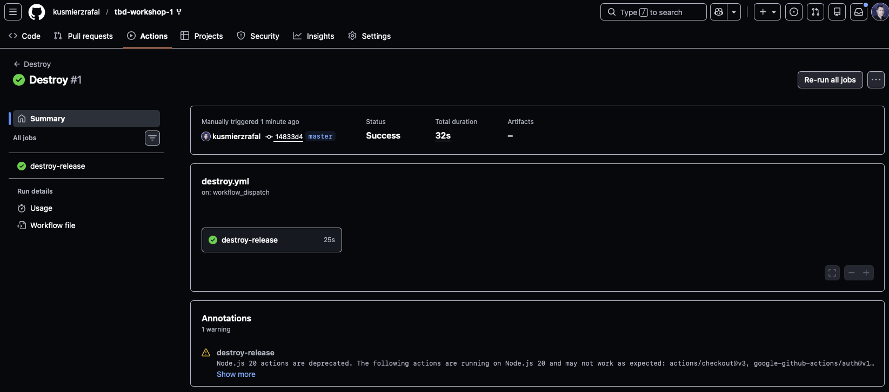
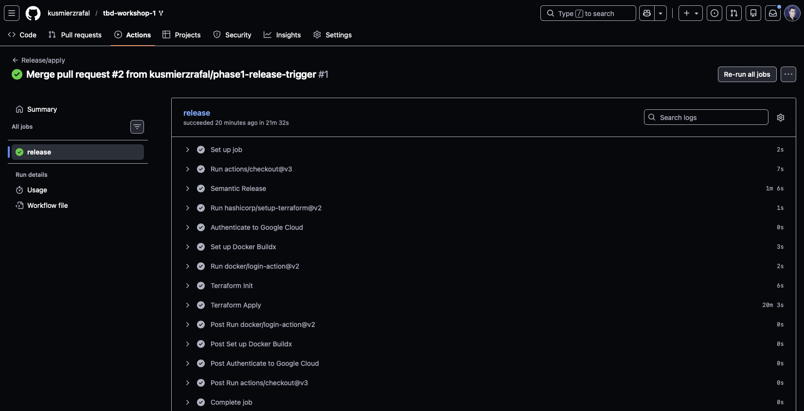
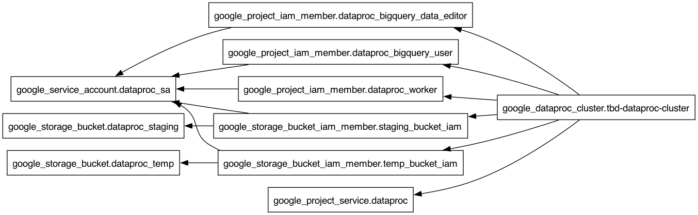
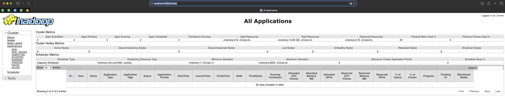

IMPORTANT ❗ ❗ ❗ Please remember to destroy all the resources after each work session. You can recreate infrastructure by creating new PR and merging it to master.


                                                                                                                                                                                                                                                                                                                                                                                  
## Phase 1 Exercise Overview

  ```mermaid
  flowchart TD
      A[🔧 Step 0: Fork repository] --> B[🔧 Step 1: Environment variables\nexport TF_VAR_*]
      B --> C[🔧 Step 2: Bootstrap\nterraform init/apply\n→ GCP project + state bucket]
      C --> D[🔧 Step 3: Quota increase\nCPUS_ALL_REGIONS ≥ 24]
      D --> E[🔧 Step 4: CI/CD Bootstrap\nWorkload Identity Federation\n→ keyless auth GH→GCP]
      E --> F[🔧 Step 5: GitHub Secrets\nGCP_WORKLOAD_IDENTITY_*\nINFRACOST_API_KEY]
      F --> G[🔧 Step 6: pre-commit install]
      G --> H[🔧 Step 7: Push + PR + Merge\n→ release workflow\n→ terraform apply]

      H --> I{Infrastructure\nrunning on GCP}

      I --> J[📋 Task 3: Destroy\nGitHub Actions → workflow_dispatch]
      I --> K[📋 Task 4: New branch\nModify tasks-phase1.md\nPR → merge → new release]
      I --> L[📋 Task 5: Analyze Terraform\nterraform plan/graph\nDescribe selected module]
      I --> M[📋 Task 6: YARN UI\ngcloud compute ssh\nIAP tunnel → port 8088]
      I --> N[📋 Task 7: Architecture diagram\nService accounts + buckets]
      I --> O[📋 Task 8: Infracost\nUsage profiles for\nartifact_registry + storage_bucket]
      I --> P[📋 Task 9: Spark job fix\nAirflow UI → DAG → debug\nFix spark-job.py]
      I --> Q[📋 Task 10: BigQuery\nDataset + external table\non ORC files]
      I --> R[📋 Task 11: Spot instances\npreemptible_worker_config\nin Dataproc module]
      I --> S[📋 Task 12: Auto-destroy\nNew GH Actions workflow\nschedule + cleanup tag]

      style A fill:#4a9eff,color:#fff
      style B fill:#4a9eff,color:#fff
      style C fill:#4a9eff,color:#fff
      style D fill:#ff9f43,color:#fff
      style E fill:#4a9eff,color:#fff
      style F fill:#ff9f43,color:#fff
      style G fill:#4a9eff,color:#fff
      style H fill:#4a9eff,color:#fff
      style I fill:#2ed573,color:#fff
      style J fill:#a55eea,color:#fff
      style K fill:#a55eea,color:#fff
      style L fill:#a55eea,color:#fff
      style M fill:#a55eea,color:#fff
      style N fill:#a55eea,color:#fff
      style O fill:#a55eea,color:#fff
      style P fill:#a55eea,color:#fff
      style Q fill:#a55eea,color:#fff
      style R fill:#a55eea,color:#fff
      style S fill:#a55eea,color:#fff
```

  Legend

  - 🔵 Blue — setup steps (one-time configuration)
  - 🟠 Orange — manual steps (GCP Console / GitHub UI)
  - 🟢 Green — infrastructure ready
  - 🟣 Purple — tasks to complete and document in tasks-phase1.md

1. Authors:

   ***group nr 5***

   ***link to forked repo: https://github.com/kusmierzrafal/tbd-workshop-1***

2. Follow all steps in README.md.

    ***completed here: https://github.com/kusmierzrafal/tbd-workshop-1/pull/1***

3. From available Github Actions select and run destroy on master branch.

    



4. Create new git branch and:
    1. Modify tasks-phase1.md file.

    2. Create PR from this branch to **YOUR** master and merge it to make new release.

    ***merged PR -> https://github.com/kusmierzrafal/tbd-workshop-1/pull/2***

    ***place the screenshot from GA after successful application of release***

    


5. Analyze terraform code. Play with terraform plan, terraform graph to investigate different modules.

    I ran `terraform init -backend-config=env/backend.tfvars` and `terraform plan -var-file env/project.tfvars` in the root module. Terraform successfully initialized the backend and compared the deployed infrastructure with the code. The result was `No changes. Your infrastructure matches the configuration.`  <br>
    <br>

    ### Selected module: `modules/dataproc`

    I selected the `dataproc` module.

    The `dataproc` module creates a managed Spark cluster used to run data processing jobs in the workshop. It reads data from BigQuery, processes it with Spark, and stores the results in Cloud Storage as ORC files.

    This module is responsible for creating the Dataproc environment used in the project. It:
    - enables the Dataproc API,
    - creates a dedicated service account for Dataproc,
    - grants IAM roles required for Dataproc and BigQuery access,
    - creates two Cloud Storage buckets used by Dataproc (`<project>-dataproc-staging` and `<project>-dataproc-temp`),
    - grants the service account permissions to use these buckets,
    - and finally creates the Dataproc cluster `tbd-cluster`.

    The module takes the following input variables:
    - `project_name`
    - `region`
    - `subnet`
    - `machine_type`
    - `image_version`

    The generated Terraform graph shows the dependency order between resources in this module. In particular, the Dataproc cluster depends on:
    - enabling the Dataproc API,
    - creating the Dataproc service account,
    - assigning IAM roles,
    - and granting permissions to the staging and temp buckets.

    ### Terraform graph output for the selected module

    

    Figure: Terraform dependency graph for the selected `dataproc` module.


6. Reach YARN UI

   ***place the command you used for setting up the tunnel, the port and the screenshot of YARN UI here***

   Hint: the Dataproc cluster has `internal_ip_only = true`, so you need to use an IAP tunnel.
   See: `gcloud compute ssh` with `-- -L <local_port>:localhost:<remote_port>` and `--tunnel-through-iap` flag.
   YARN ResourceManager UI runs on port **8088**.

   #### Command used to create the tunnel

    ```bash
    PROJECT="tbd-2026l-5"
    REGION="europe-west1"
    CLUSTER="tbd-cluster"

    ZONE=$(gcloud dataproc clusters describe "$CLUSTER" \
    --region="$REGION" \
    --project="$PROJECT" \
    --format='value(config.gceClusterConfig.zoneUri.basename())')

    gcloud compute ssh "${CLUSTER}-m" \
    --project="$PROJECT" \
    --zone="$ZONE" \
    --tunnel-through-iap -- \
    -NL 1080:localhost:8088
    ```

    #### Port used

    Local port: 1080
    
    Remote YARN ResourceManager port: 8088

    
    Figure: YARN ResourceManager UI reached through an IAP SSH tunnel.

7. Draw an architecture diagram (e.g. in draw.io) that includes:
    1. Description of the components of service accounts
    2. List of buckets for disposal

    ***place your diagram here***

8. Create a new PR and add costs by entering the expected consumption into Infracost
For all the resources of type: `google_artifact_registry_repository`, `google_storage_bucket`
create a sample usage profiles and add it to the Infracost task in CI/CD pipeline. Usage file [example](https://github.com/infracost/infracost/blob/master/infracost-usage-example.yml)

   ***place the expected consumption you entered here***

   ***place the screenshot from infracost output here***

9. Find and correct the error in spark-job.py

    After `terraform apply` completes, connect to the Airflow cluster:
    ```bash
    gcloud container clusters get-credentials airflow-cluster --zone europe-west1-b --project PROJECT_NAME
    ```
    
    Then check the external IP (AIRFLOW_EXTERNAL_IP) of the webserver service:
    kubectl get svc -n airflow airflow-webserver                                                                                                                                                                 
                                              
                                                                                                                                                                                                               
    ▎ Note: If EXTERNAL-IP shows <pending>, wait a moment and retry — LoadBalancer IP allocation may take 1-2 minutes.  

    DAG files are synced automatically from your GitHub repo via git-sync sidecar.
    Airflow variables and the `google_cloud_default` GCP connection are also configured by Terraform.

    a) In the Airflow UI (http://AIRFLOW_EXTERNAL_IP:8080, login: admin/admin), find the `dataproc_job` DAG, unpause it and trigger it manually.

    ***place a screenshot of the DAG in the Airflow UI***

    b) The DAG will fail. Examine the task logs in the Airflow UI to find the root cause.

    ***paste the relevant error message from the Airflow task log***

    ***describe what the error is and how you found it***

    c) Fix the error in `modules/data-pipeline/resources/spark-job.py` and re-upload the file to GCS:
    ```bash
    gsutil cp modules/data-pipeline/resources/spark-job.py gs://PROJECT_NAME-code/spark-job.py
    ```
    Then trigger the DAG again from the Airflow UI.

    ***paste the link to the fixed file***

    d) Verify the DAG completes successfully and check that ORC files were written to the data bucket:
    ```bash
    gsutil ls gs://PROJECT_NAME-data/data/shakespeare/
    ```

    ***place a screenshot of the successful DAG run in Airflow UI***

11. Create a BigQuery dataset and an external table using SQL

    Using the ORC data produced by the Spark job in task 9, create a BigQuery dataset and an external table.

    Note: the dataset must be created in the same region as the GCS bucket (`europe-west1`), e.g.:
    ```bash
    bq mk --dataset --location=europe-west1 shakespeare
    ```

    ***place the SQL code and query output here***

    ***why does ORC not require a table schema?***

12. Add support for preemptible/spot instances in a Dataproc cluster

    ***place the link to the modified file and inserted terraform code***

13. Triggered Terraform Destroy on Schedule or After PR Merge. Goal: make sure we never forget to clean up resources and burn money.

Add a new GitHub Actions workflow that:
  1. runs terraform destroy -auto-approve
  2. triggers automatically:

   a) on a fixed schedule (e.g. every day at 20:00 UTC)

   b) when a PR is merged to master containing [CLEANUP] tag in title

Steps:
  1. Create file .github/workflows/auto-destroy.yml
  2. Configure it to authenticate and destroy Terraform resources
  3. Test the trigger (schedule or cleanup-tagged PR)

Hint: use the existing `.github/workflows/destroy.yml` as a starting point.

***paste workflow YAML here***

***paste screenshot/log snippet confirming the auto-destroy ran***

***write one sentence why scheduling cleanup helps in this workshop***
