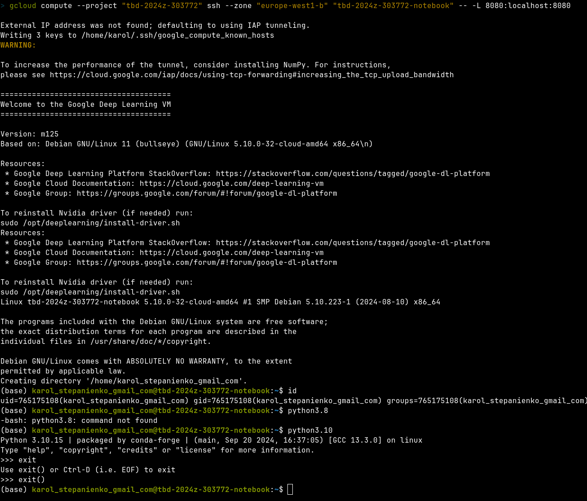
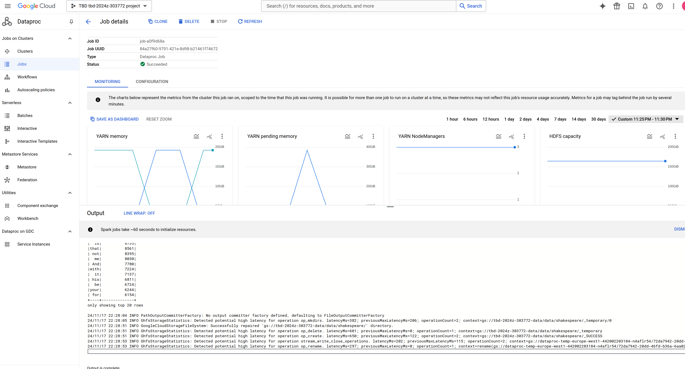

IMPORTANT ❗ ❗ ❗ Please remember to destroy all the resources after each work session. You can recreate infrastructure by creating new PR and merging it to master.


1. Authors:

    ***enter your group nr***

    DONE:
    Team 4

    ***link to forked repo***

    DONE:
    [https://github.com/karolstepanienko/tbd-workshop-1](https://github.com/karolstepanienko/tbd-workshop-1)
   
2. Follow all steps in README.md.

    DONE: screenshots in [README.md](README.md)

3. Select your project and set budget alerts on 5%, 25%, 50%, 80% of 50$ (in cloud console -> billing -> budget & alerts -> create buget; unclick discounts and promotions&others while creating budget).

    

    DONE:

    

    


5. From available Github Actions select and run destroy on main branch.

    DONE:
    

7. Create new git branch and:
    1. Modify tasks-phase1.md file.

        DONE in: [a263ba8](https://github.com/karolstepanienko/tbd-workshop-1/pull/2/commits/a263ba8918de3c80cd2b184b86262ab719b64b47)
    
    2. Create PR from this branch to **YOUR** master and merge it to make new release.

        DONE PR: [https://github.com/karolstepanienko/tbd-workshop-1/pull/2](https://github.com/karolstepanienko/tbd-workshop-1/pull/2)
    
    ***place the screenshot from GA after successful application of release***

    DONE:
    

8. Analyze terraform code. Play with terraform plan, terraform graph to investigate different modules.

    ***describe one selected module and put the output of terraform graph for this module here***

    DONE:
    <!-- terraform graph -type=plan | dot -Tpng > terraform-plan-graph-composer.png # to big
    terraform graph -type=plan | dot -Tpng > terraform-plan-graph-gcr.png # great
    terraform graph -type=plan | dot -Tpng > terraform-plan-graph-dataproc.png # great -->

    ```
    terraform plan -var-file env/project.tfvars -out main.tfplan
    ```
    

    Module: vertex-ai-workbench

    Description: This module is responsible for creating a Virtual Machine with
    a preconfigured disk image that will have all the necessary tools for
    interacting with infrastructure that runs Big Data analyses. It's more
    efficient and easier to use rather than ensuring that our local private
    machine has access to all necessary cloud resources. It also has an easily
    accessible web interface.

    Resources:
    - `google_notebooks_instance` - creates and configures the VM,
    - `google_project_service` - allows project access management to services
        provided by Google (here it's notebooks API),
    - `google_project_iam_binding` - assigns role (a set of permissions) to
        a service account (here for creating short-lived credentials for
        a service account that will be later used for authentication to
        Google services from Jupyter notebooks)
    - `google_storage_bucket` - creates a storage bucket, simplest form
        of file storage in GCS
    - `google_storage_bucket_iam_binding` - grants read-only access to
        a storage bucket for a service account (necessary for fetching
        the post startup script)
    - `google_storage_bucket_object` - here uploads a notebook post startup
        config script to GCS when running terraform apply

    Graph:
    ```
    cd modules/vertex-ai-workbench
    terraform init -upgrade
    terraform graph -type=plan | dot -Tpng > terraform-plan-graph-vertex-ai-workbench.png
    ```
    

9. Reach YARN UI

   ***place the command you used for setting up the tunnel, the port and the screenshot of YARN UI here***

   DONE:
    ```bash
    # Create an SSH tunnel using local port 1080
    gcloud compute ssh tbd-cluster-m \
    --project=tbd-2024z-303772 \
    --zone=europe-west1-d -- -D 1080 -N

    # Run Chrome and connect through the proxy
    /usr/bin/google-chrome --proxy-server="socks5://localhost:1080" \
    --user-data-dir="/tmp/tbd-cluster-m" http://tbd-cluster-m:8088
    ```
    

10. Draw an architecture diagram (e.g. in draw.io) that includes:
    1. VPC topology with service assignment to subnets
    2. Description of the components of service accounts
    3. List of buckets for disposal
    4. Description of network communication (ports, why it is necessary to specify the host for the driver) of Apache Spark running from Vertex AI Workbech
  
    ***place your diagram here***

11. Create a new PR and add costs by entering the expected consumption into Infracost
For all the resources of type: `google_artifact_registry`, `google_storage_bucket`, `google_service_networking_connection`
create a sample usage profiles and add it to the Infracost task in CI/CD pipeline. Usage file [example](https://github.com/infracost/infracost/blob/master/infracost-usage-example.yml) 

   ***place the expected consumption you entered here***

   ***place the screenshot from infracost output here***

11. Create a BigQuery dataset and an external table using SQL

    ***place the code and output here***

    DONE:
    ```sql
    CREATE SCHEMA IF NOT EXISTS demo OPTIONS(location = 'europe-west1');
    CREATE OR REPLACE EXTERNAL TABLE demo.shakespeare
    OPTIONS (
    
    format = 'ORC',
    uris = ['gs://tbd-2024z-303772-data/data/shakespeare/*.orc']);
    SELECT * FROM demo.shakespeare ORDER BY sum_word_count DESC LIMIT 5;
    ```
    Output:
    
    

    ```SQL
    CREATE SCHEMA IF NOT EXISTS demo OPTIONS(location = 'europe-west1');

    CREATE OR REPLACE EXTERNAL TABLE demo.example (
    column1 STRING,
    column2 STRING,
    column3 STRING,
    )
    OPTIONS (

    field_delimiter = ';',
    skip_leading_rows = 1,
    format = 'CSV',
    uris = ['gs://tbd-2024z-303772-data/example-data.csv']);

    SELECT * FROM demo.example;
    ```
    Output:
    

    Data loaded to the table: [example-data.csv](example-data.csv)

    ***why does ORC not require a table schema?***

    DONE:

    `When you load ORC files into BigQuery, the table schema is automatically retrieved from the self-describing source data.`

    Source: [https://cloud.google.com/bigquery/docs/loading-data-cloud-storage-orc#orc_schemas](https://cloud.google.com/bigquery/docs/loading-data-cloud-storage-orc#orc_schemas)
  
12. Start an interactive session from Vertex AI workbench:

    ***place the screenshot of notebook here***

    DONE:

    Web UI:
    
    ```bash
    # command used to establish a tunnel and open an ssh session to the VM
    gcloud compute --project "tbd-2024z-303772" ssh --zone "europe-west1-b" "tbd-2024z-303772-notebook" -- -L 8080:localhost:8080
    ```
    SSH shell:
    

13. Find and correct the error in spark-job.py

    ***describe the cause and how to find the error***

    DONE:

    CAUSE:

    Error in [spark-job.py](https://github.com/karolstepanienko/tbd-workshop-1/blob/master/modules/data-pipeline/resources/spark-job.py#L21)
    is caused by an incorrect reference to a GCS bucket, that is no longer
    available.
    ```
    : java.io.IOException: Error accessing gs://tbd-2025z-9900-data/data/shakespeare
    ...
    Caused by: com.google.cloud.hadoop.repackaged.gcs.com.google.api.client.googleapis.json.GoogleJsonResponseException: 403 Forbidden
    GET https://storage.googleapis.com/storage/v1/b/tbd-2025z-9900-data/o/data%2Fshakespeare?fields=bucket,name,timeCreated,updated,generation,metageneration,size,contentType,contentEncoding,md5Hash,crc32c,metadata
    {
    "code" : 403,
    "errors" : [ {
        "domain" : "global",
        "location" : "Authorization",
        "locationType" : "header",
        "message" : "The billing account for the owning project is disabled in state closed",
        "reason" : "accountDisabled"
    } ],
    "message" : "The billing account for the owning project is disabled in state closed"
    }
    ```
    Error can be found in logs of failed jobs on Dataproc cluster:
    

    FIX:

    In order to fix the error, link to the GCS bucket needs to be corrected to
    an existing one that the service account will be able to access.

    Changed from:

    `DATA_BUCKET = "gs://tbd-2025z-9900-data/data/shakespeare/"`

    to

    `DATA_BUCKET = "gs://tbd-2024z-303772-data/data/shakespeare/"`

    Fixed in commit: [ad97043](https://github.com/karolstepanienko/tbd-workshop-1/commit/ad97043985063b43cf6435e6882185e4dd49d699)
    which results in a successfully passing job:
    

14. Additional tasks using Terraform:

    1. Add support for arbitrary machine types and worker nodes for a Dataproc cluster and JupyterLab instance

    ***place the link to the modified file and inserted terraform code***

    DONE: Commit: [3625130](https://github.com/karolstepanienko/tbd-workshop-1/commit/3625130dda5f053f1125383b58add1c06f22c984)

    2. Add support for preemptible/spot instances in a Dataproc cluster

    ***place the link to the modified file and inserted terraform code***

    DONE: Commit: [fc53da8](https://github.com/karolstepanienko/tbd-workshop-1/commit/fc53da86bf7b9b60d568737caa05a677312e6f1b)

    Source: [terraform docs: preemptible_worker_config](https://registry.terraform.io/providers/hashicorp/google/latest/docs/resources/dataproc_cluster#nested_preemptible_worker_config)

    3. Perform additional hardening of Jupyterlab environment, i.e. disable sudo access and enable secure boot

    ***place the link to the modified file and inserted terraform code***

    DONE: Commit: [37eb083](https://github.com/karolstepanienko/tbd-workshop-1/commit/37eb08336eec5826e87da04a0aac0a0fa41f4982)

    Source [terraform docs: shielded_instance_config](https://registry.terraform.io/providers/hashicorp/google/5.44.2/docs/resources/notebooks_instance#shielded_instance_config-3)

    4. (Optional) Get access to Apache Spark WebUI

    ***place the link to the modified file and inserted terraform code***
