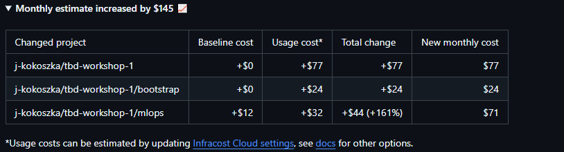

IMPORTANT ❗ ❗ ❗ Please remember to destroy all the resources after each work session. You can recreate infrastructure by creating new PR and merging it to master.
  


1. Authors:

   Group number 7
   * Kasperczak Jonatan: 341208
   * Kokoszka Jakub: 304154
   * Będkowski Patryk: 310603
   
   https://github.com/j-kokoszka/tbd-workshop-1/tree/master
   
2. Follow all steps in README.md.

3. Select your project and set budget alerts on 5%, 25%, 50%, 80% of 50$ (in cloud console -> billing -> budget & alerts -> create buget; unclick discounts and promotions&others while creating budget).

  

5. From avaialble Github Actions select and run destroy on main branch.
   
6. Create new git branch and:
    1. Modify tasks-phase1.md file.
    
    2. Create PR from this branch to **YOUR** master and merge it to make new release. 
   
  

7. Analyze terraform code. Play with terraform plan, terraform graph to investigate different modules.

  
   
## This module is designed to build and manage a Docker image with configurations for a dbt and Spark environment. 

### The graph illustrates that:


The Docker provider is configured to enable Terraform to interact with Docker resources.
The Docker image (docker_image.dbt) is created using several input variables, making the image customizable based on the versions of dbt and Spark.

Outputs are defined to capture and provide access to the created Docker image's name and URI, which are useful for referencing the image in other modules or for deployment.

### Provider Configuration:

Provider["registry.terraform.io/kreuzwerker/docker"]: This provider is used to interact with Docker resources. The provider here is from the kreuzwerker namespace on the Terraform registry, specifically the Docker provider.
   
8. Reach YARN UI
 
Command used:
 
`gcloud compute ssh tbd-cluster-m --project=tbd-2024l-304154 --zone=europe-west1-d --tunnel-through-iap -- -L 8088:localhost:8088`

 
 
   
9. Draw an architecture diagram (e.g. in draw.io) that includes:

   1. VPC topology with service assignment to subnets

  

**tbd-composer-sa**

Description: Used for running tasks in the Composer environment.

- Roles:

    - Composer Worker: Permissions for executing tasks in Composer.
    - Dataproc Editor: Manage Dataproc clusters.
    - Service Account User: Impersonate other service accounts.


**tbd-terraform**

Description: Manages Terraform infrastructure with full control over resources.

- Role:

    - Owner: Full project access.


**iac**

Description: Used for Infrastructure as Code operations within the project.

- Roles:

    - Editor: Modify project resources.
    - Service Account Token Creator: Generate OAuth2 tokens for authentication.

   
Description of network communication:

It is necessary because in Apache Spark, specifying the driver host is essential because the driver executes the main() function and creates the SparkContext. It communicates with worker nodes to distribute tasks and with the master node to monitor their status and performance


10. Create a new PR and add costs by entering the expected consumption into Infracost
For all the resources of type: `google_artifact_registry`, `google_storage_bucket`, `google_service_networking_connection`
create a sample usage profiles and add it to the Infracost task in CI/CD pipeline. Usage file [example](https://github.com/infracost/infracost/blob/master/infracost-usage-example.yml) 

```yml
version: 0.1
resource_usage:
 google_artifact_registry_repository:
   storage_gb: 50 # Total data stored in the repository in GB
   monthly_egress_data_transfer_gb: # Monthly data delivered from the artifact registry repository in GB. You can specify any number of Google Cloud regions below, replacing - for _ e.g.:
     europe_west3: 20 # GB of data delivered from the artifact registry to europe-west3.
 google_storage_bucket:
   storage_gb: 500 # Total size of bucket in GB.
   monthly_class_a_operations: 1000000 # Monthly number of class A operations (object adds, bucket/object list).
   monthly_class_b_operations: 12500000 # Monthly number of class B operations (object gets, retrieve bucket/object metadata).
   monthly_data_retrieval_gb: 250 # Monthly amount of data retrieved in GB.
   monthly_egress_data_transfer_gb: # Monthly data transfer from Cloud Storage to the following, in GB:
     same_continent: 200 # Same continent.
     worldwide: 0 # Worldwide excluding Asia, Australia.
     asia: 0 # Asia excluding China, but including Hong Kong.
     china: 0 # China excluding Hong Kong.
     australia: 0 # Australia.
 google_service_networking_connection:
   monthly_egress_data_transfer_gb: # Monthly VM-VM data transfer from VPN gateway to the following, in GB:
     same_region: 100 # VMs in the same Google Cloud region.
     us_or_canada: 0 # From a Google Cloud region in the US or Canada to another Google Cloud region in the US or Canada.
     europe: 100 # Between Google Cloud regions within Europe.
     asia: 0 # Between Google Cloud regions within Asia.
     south_america: 0 # Between Google Cloud regions within South America.
     oceania: 0 # Indonesia and Oceania to/from any Google Cloud region.
     worldwide: 100 # to a Google Cloud region on another continent.
```

 
  


11. Create a BigQuery dataset and an external table using SQL
    
    ***place the code and output here***

  
  
 
    why does ORC not require a table schema?
   
    Because ORC is included in file.
  
12. Start an interactive session from Vertex AI workbench:

    ***place the screenshot of notebook here***

    we logged in using this command:

```bash
 gcloud compute --project "tbd-2024l-304154" ssh --zone "europe-west1-b" "tbd-2024l-304154-notebook" -- -L 8080:localhost:8080
```

  
   
13. Find and correct the error in spark-job.py

    There was incorect path to the bucket in spark-job.py

    We fixed name and it worked just fine.

  
  
   
   
14. Additional tasks using Terraform:

    1. Add support for arbitrary machine types and worker nodes for a Dataproc cluster and JupyterLab instance

    ***place the link to the modified file and inserted terraform code***
 ```
    https://github.com/j-kokoszka/tbd-workshop-1/commit/0010e17b1e2dafdb61422fb7e51efc37a932f0d6
 ```
    2. Add support for preemptible/spot instances in a Dataproc cluster

    ***place the link to the modified file and inserted terraform code***
```
    https://github.com/j-kokoszka/tbd-workshop-1/commit/cb464438f947e1fbe9640f5e387bf04004df1363
``` 
    3. Perform additional hardening of Jupyterlab environment, i.e. disable sudo access and enable secure boot
    
    ***place the link to the modified file and inserted terraform code***
```
    https://github.com/j-kokoszka/tbd-workshop-1/commit/c6b16d512294db81c89242dc925920447227e966
```
    4. (Optional) Get access to Apache Spark WebUI

    ***place the link to the modified file and inserted terraform code***
```
    https://github.com/j-kokoszka/tbd-workshop-1/commit/9326687b4829473eb4813a7c00174287502abb6b
```

  
   
