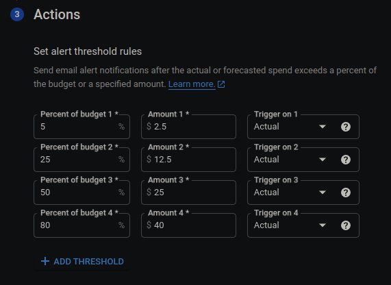

IMPORTANT ❗ ❗ ❗ Please remember to destroy all the resources after each work session. You can recreate infrastructure by creating new PR and merging it to master.


1. Authors:

    DONE:
   <!-- ***enter your group nr*** -->
   Team 4

   <!-- ***link to forked repo*** -->
   https://github.com/karolstepanienko/tbd-workshop-1
   
2. Follow all steps in README.md.

    IN PROGRESS

3. Select your project and set budget alerts on 5%, 25%, 50%, 80% of 50$ (in cloud console -> billing -> budget & alerts -> create buget; unclick discounts and promotions&others while creating budget).

    

    DONE:

    

    


5. From available Github Actions select and run destroy on main branch.
   
7. Create new git branch and:
    1. Modify tasks-phase1.md file.
    
    2. Create PR from this branch to **YOUR** master and merge it to make new release. 
    
    ***place the screenshot from GA after successful application of release***


8. Analyze terraform code. Play with terraform plan, terraform graph to investigate different modules.

    ***describe one selected module and put the output of terraform graph for this module here***
   
9. Reach YARN UI
   <!-- ***place the command you used for setting up the tunnel, the port and the screenshot of YARN UI here*** -->
   DONE:
    ```bash
    # Create an SSH tunnel using local port 1080
    gcloud compute ssh tbd-cluster-m \
    --project=tbd-2024z-303772 \
    --zone=europe-west1-d -- -D 1080 -N

    # Run Chrome and connect through the proxy
    /usr/bin/google-chrome --proxy-server="socks5://localhost:1080" \
    --user-data-dir="/tmp/tbd-cluster-m" http://tbd-cluster-m:8088
    ```
    

10. Draw an architecture diagram (e.g. in draw.io) that includes:
    1. VPC topology with service assignment to subnets
    2. Description of the components of service accounts
    3. List of buckets for disposal
    4. Description of network communication (ports, why it is necessary to specify the host for the driver) of Apache Spark running from Vertex AI Workbech
  
    ***place your diagram here***

11. Create a new PR and add costs by entering the expected consumption into Infracost
For all the resources of type: `google_artifact_registry`, `google_storage_bucket`, `google_service_networking_connection`
create a sample usage profiles and add it to the Infracost task in CI/CD pipeline. Usage file [example](https://github.com/infracost/infracost/blob/master/infracost-usage-example.yml) 

   ***place the expected consumption you entered here***

   ***place the screenshot from infracost output here***

11. Create a BigQuery dataset and an external table using SQL
    
    ***place the code and output here***
   
    ***why does ORC not require a table schema?***

  
12. Start an interactive session from Vertex AI workbench:

    ***place the screenshot of notebook here***
   
13. Find and correct the error in spark-job.py

    ***describe the cause and how to find the error***

14. Additional tasks using Terraform:

    1. Add support for arbitrary machine types and worker nodes for a Dataproc cluster and JupyterLab instance

    ***place the link to the modified file and inserted terraform code***
    
    3. Add support for preemptible/spot instances in a Dataproc cluster

    ***place the link to the modified file and inserted terraform code***
    
    3. Perform additional hardening of Jupyterlab environment, i.e. disable sudo access and enable secure boot
    
    ***place the link to the modified file and inserted terraform code***

    4. (Optional) Get access to Apache Spark WebUI

    ***place the link to the modified file and inserted terraform code***
