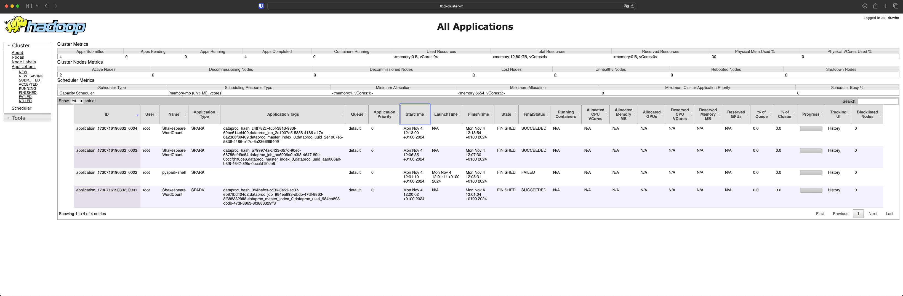

IMPORTANT ❗ ❗ ❗ Please remember to destroy all the resources after each work session. You can recreate infrastructure by creating new PR and merging it to master.
  

1. Authors:

   ***Grupa nr 8 (Jakub Dzięgielewski, Jakub Śliwa, Filip Matysik)***

   ***[link do sforkowanego repo](https://github.com/JakubDziegielewski/tbd-workshop-1)***
   
2. Follow all steps in README.md.

Przeszliśmy kroki 1-9 opisane w README.md, czego efektem było wypuszczenie pierwszego release'a. Kroki 10-11 wyszczególnione są dalej w tym pliku jako zadania 11 i 14, toteż ich wykonanie opiszemy właśnie tam.

3. Select your project and set budget alerts on 5%, 25%, 50%, 80% of 50$ (in cloud console -> billing -> budget & alerts -> create buget; unclick discounts and promotions&others while creating budget).

Stworzyliśmy budżet o nazwie TBD_gr8_budget i ustaliliśmy alerty na odpowiednich poziomach wykorzystania dostępnych środków.

5. From avaialble Github Actions select and run destroy on main branch.

Kończąc pierwszą udaną sesję pracy, poprzez GA dokonaliśmy zniszczenia aktualnej infrastruktury.

   
7. Create new git branch and:
    1. Modify tasks-phase1.md file.
    
    2. Create PR from this branch to **YOUR** master and merge it to make new release. 
    
Rozpoczynając drugą sesję pracy, zmergowaliśmy gałąź ze zmodyfikowanym plikiem tasks-phase1.md, by ponownie postawić infrastrukturę. Drugi release przeszedł pomyślnie.

8. Analyze terraform code. Play with terraform plan, terraform graph to investigate different modules.

Moduły terraforma znajdują się przede wszystkim w katalogu modules, są nimi m.in. composer, vertex-ai-workbench,  vpc czy dataproc. Przeanalizowaliśmy ten ostatni, a wynik wywołania `terraform graph` widać poniżej:

Moduł dataproc jako input przyjmuje 5 zmiennych: image_version, machine_type, project_name, region oraz subnet. W module powoływany jest Dataproc service oraz definiowany jest Dataproc cluster, zależny od tego serwisu. Cluster składa się z jednego mastera oraz dwóch worker'ów. Jako output zwracany jest dataproc_cluster_name utworzonego clustra.

9. Reach YARN UI
   
Udało nam się dotrzeć do YARN UI za pomocą dwóch komend.
Najpierw stworzyliśmy tunel ssh: `gcloud compute ssh tbd-cluster-m \   --project=tbd-2024l-335209 \   --zone=europe-west1-d -- -D 1080 -N`. 
Następnie otworzyliśmy przeglądarkę `/usr/bin/google-chrome \   --proxy-server="socks5://localhost:1080" \   --user-data-dir="/tmp/tbd-cluster-m" http://tbd-cluster-m:8088`.

   
10. Draw an architecture diagram (e.g. in draw.io) that includes:
    1. VPC topology with service assignment to subnets
    2. Description of the components of service accounts
    3. List of buckets for disposal
    4. Description of network communication (ports, why it is necessary to specify the host for the driver) of Apache Spark running from Vertex AI Workbech
  
    1. d 
    2.  tbd-2024l-335209-data@tbd-2024l-335209.iam.gserviceaccount.com	- 	service account that manages the Dataproc and Cloud Composer, assigned to tf local value in composer folder as "composer_account_id"
        tbd-2024l-335209-lab@tbd-2024l-335209.iam.gserviceaccount.com		-	 service account responsible for IaC managment, comunication with terraform, assigned to tf variable "iac_service_account"
        143640390419-compute@developer.gserviceaccount.com - default service account, allows for communication and authentication of other services with Google Cloud and its APIs
    3. 
    4. There are 4 Virtual Machines in the project, 3 of them are related to Dataproc clusters (1 Master and 2 Worker nodes) and of them is for running the Jupyter Notebook and Vertex AI.
       

       spark_driver_port = 30000, spark_blockmgr_port = 30001 (for spark block management). Host must be specified for the driver for it to be able to manage tasks within its worker nodes in the cluster.

11. Create a new PR and add costs by entering the expected consumption into Infracost
For all the resources of type: `google_artifact_registry`, `google_storage_bucket`, `google_service_networking_connection`
create a sample usage profiles and add it to the Infracost task in CI/CD pipeline. Usage file [example](https://github.com/infracost/infracost/blob/master/infracost-usage-example.yml) 

Na podstawie przykładowego pliku wybraliśmy z niego potrzebne do naszych celów elementy. Plik `infracost-usage.yml`, zawierający spodziewane wartości konsumpcji, dostępny jest pod tym [linkiem](https://github.com/JakubDziegielewski/tbd-workshop-1/blob/master/infracost-usage.yml).

Niestety, zgodnie z naszymi wcześniejszymi komunikatami, nie udało nam się skonfigurować infracosta tak, aby działał poprawnie.
Próbowaliśmy dodać do komend infracost breakdown oraz infracost diff w `.github/workflows/pull-request.yml` flagę `--usage-file` ze wskazaniem na odpowiedni plik, jednak problemem było to, że różne projekty infracostowe (main, cicd_bootsrap, bootsrap i mlops) występowały pod tą samą nazwą (co obrazuje zrzut ekranu poniżej):

Przez to wyrzucany był błąd przy komendzie diff:

Kolejny dowód na to, że z jakiegoś powodu plik `/tmp/infracost-base.json` generowany był niepoprawnie:

Rozwiązaniem typu workaround, które udało nam się zastosować, jest robienie infracost breakdown oraz diff dla każdego z infracostowych projektów osobno - jest to nieefektywne, ponieważ zamiast 1 razu należy to zrobić 4 razy (dla każdego projektu osobno), lecz w naszej opinii efekt końcowy jest taki sam jak w przypadku poprawnego działania.

Zostawiamy zatem [PR](https://github.com/JakubDziegielewski/tbd-workshop-1/pull/14) z naszym workaround'em i wrzucamy zrzut ekranu z otrzymanego działania infracost'a:

11. Create a BigQuery dataset and an external table using SQL

Udało nam się stworzyć tabelę shakespeare, jak widać na poniższym zrzucie ekranu. Powodzenie tej operacji było możliwe dopiero po naprawieniu błędu w pliku spark-job.py, gdyż dopiero sukces tego joba gwarantował dane, na podstawie których tworzona była tabela.
    

ORC nie potrzebuje schematu tabeli, ponieważ wykorzystuje podejście "schema-on-read". Polega ono na tym, że schemat jest automatycznie dedukowany lub określany w momencie odczytu danych, a nie w chwili ich zapisywania. Podejście to zwiększa elastyczność i jest szczególnie użyteczne, gdy schemat może ulegać częstym zmianom.

  
12. Start an interactive session from Vertex AI workbench:

Udało nam się rozpocząć interaktywną sesję z wykorzystaniem naszego notebook'a jupyter'owego z Vertex AI workbench za pomocą komendy `gcloud compute --project "tbd-2024l-335209" ssh --zone "europe-west1-b" "tbd-2024l-335209-notebook" -- -L 8080:localhost:8080`.

   
13. Find and correct the error in spark-job.py

W konsoli Google'a weszliśmy w logi i przeanalizowaliśmy informacje dotyczące nieudanego joba. Jak widać na zrzucie ekranu poniżej, problemem było odwoływanie się do bucketu, który nie istniał:

W momencie, gdy poprawiliśmy nazwę bucketu, job wykonał się poprawnie. Poniżej widać miejsce, w którym należało wprowadzić zmiany:

oraz dowód, że job przechodzi:

15. Additional tasks using Terraform:

Zamiast linków do plików podajemy linki do commit'ów, ponieważ modyfikowanych jest zawsze kilka plików.

a) Add support for arbitrary machine types and worker nodes for a Dataproc cluster and JupyterLab instance

[link do commita](https://github.com/JakubDziegielewski/tbd-workshop-1/commit/644c8f1d7230821ff870540bc66492ab412c67d5)

Aby dodać możliwość określenia rodzaju typów maszyn, podjęliśmy kilka kroków. Zadeklarowaliśmy w `variables.tf` dwie nowe zmienne odpowiadające za typy maszyn dla dataproc oraz instancji jupytera z odpowiednimi wartościami domyślnymi. Następnie w `main.tf` w deklaracji modułów przekazaliśmy wartości tych zmiennych do modułów. W dataproc zmodyfikowaliśmy jedynie `modules/dataproc/variables.tf` usuwając wartość domyślną, gdyż występuje ona już poziom wyżej. W vertex-ai-workbench zdefiniowaliśmy zmienną w `modules/vertex-ai-workbench/variables.tf`, a następnie wykorzystaliśmy ją w `modules/vertex-ai-workbench/main.tf` przy deklaracji instancji notebooka.

b) Add support for preemptible/spot instances in a Dataproc cluster

[link do commita](https://github.com/JakubDziegielewski/tbd-workshop-1/commit/e3a63871a367c9f9d01bb51533fa608b7b1aa77c)

Aby dodać możliwość dodawania instancji preemptible w clustrze dataproc oraz determinowania liczby worker'ów zadeklarowaliśmy w pliku `variables.tf` dwie nowe zmienne numeryczne z odpowiednimi wartościami domyślnymi. Następnie w `main.tf` przy konfiguracji modułu dataproc przekazaliśmy dalej ich wartości. Zdefiniowaliśmy w `modules/dataproc/variables.tf` dwie analogiczne zmienne, które następnie w `main.tf` użyliśmy przy konfiguracji clustra dataproc.
    
c) Perform additional hardening of Jupyterlab environment, i.e. disable sudo access and enable secure boot
    
[link do commita](https://github.com/JakubDziegielewski/tbd-workshop-1/commit/8866c0f434c0de55b722bf061d82960c8a45e2c1)

W celu dokonania hardeningu modyfikowaliśmy jedynie plik `modules/vertex-ai-workbench`, gdzie w środku konfiguracji instancji notebook'a dodaliśmy do metadanych flagę `notebook-disable-root = true` oraz umożliwiliśmy secure boot'a `shielded_instance_config { enable_secure_boot = true }`.

d) (Optional) Get access to Apache Spark WebUI

***place the link to the modified file and inserted terraform code***
