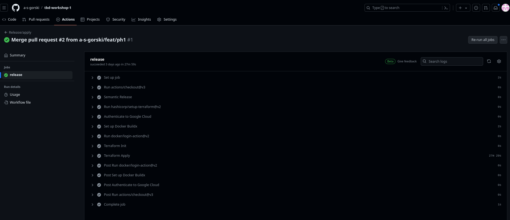

IMPORTANT ❗ ❗ ❗ Please remember to destroy all the resources after each work session. You can recreate infrastructure by creating new PR and merging it to master.
  


1. Authors:

    Grupa nr 7
    - Adam Górski
    - Zuzanna Górecka
    - Michał Oracki

    [Link to repo](https://github.com/a-s-gorski/tbd-workshop-1)
   
   
2. Follow all steps in README.md.

3. Select your project and set budget alerts on 5%, 25%, 50%, 80% of 50$ (in cloud console -> billing -> budget & alerts -> create buget; unclick discounts and promotions&others while creating budget).

  

5. From avaialble Github Actions select and run destroy on main branch.
   
7. Create new git branch and:
    1. Modify tasks-phase1.md file.
    
    2. Create PR from this branch to **YOUR** master and merge it to make new release. 
    
    ***place the screenshot from GA after succesfull application of release***



8. Analyze terraform code. Play with terraform plan, terraform graph to investigate different modules.

    ***describe one selected module and put the output of terraform graph for this module here***
# TODO - dodać opis

   
9. Reach YARN UI
   
   ```bash
    gcloud compute ssh --zone "europe-west1-d" "tbd-cluster-m" --tunnel-through-iap --project "tbd-2024l-3040540" -- -L 8088:localhost:8088
   ```

   
10. Draw an architecture diagram (e.g. in draw.io) that includes:
    1. VPC topology with service assignment to subnets
    2. Description of the components of service accounts
    3. List of buckets for disposal
    4. Description of network communication (ports, why it is necessary to specify the host for the driver) of Apache Spark running from Vertex AI Workbech
  


11. Create a new PR and add costs by entering the expected consumption into Infracost
For all the resources of type: `google_artifact_registry`, `google_storage_bucket`, `google_service_networking_connection`
create a sample usage profiles and add it to the Infracost task in CI/CD pipeline. Usage file [example](https://github.com/infracost/infracost/blob/master/infracost-usage-example.yml) 

   ***place the expected consumption you entered here***

   ```yaml
    version: 0.1

    google_artifact_registry_repository.registry:
        storage_gb: 15 # Total data stored in the repository in GB
        monthly_egress_data_transfer_gb: # Monthly data delivered from the artifact registry repository in GB. You can specify any number of Google Cloud regions below, replacing - for _ e.g.:
        europe_west1: 10 # GB of data delivered from the artifact registry to europe-north1.


    google_storage_bucket.my_bucket:
    storage_gb: 150                   # Total size of bucket in GB.
    monthly_class_a_operations: 40 # Monthly number of class A operations (object adds, bucket/object list).
    monthly_class_b_operations: 20 # Monthly number of class B operations (object gets, retrieve bucket/object metadata).
    monthly_data_retrieval_gb: 5    # Monthly amount of data retrieved in GB.
    monthly_egress_data_transfer_gb:  # Monthly data transfer from Cloud Storage to the following, in GB:
        same_continent: 55

    google_storage_bucket.mlflow_artifacts_bucket:
    storage_gb: 150                   # Total size of bucket in GB.
    monthly_class_a_operations: 40 # Monthly number of class A operations (object adds, bucket/object list).
    monthly_class_b_operations: 20 # Monthly number of class B operations (object gets, retrieve bucket/object metadata).
    monthly_data_retrieval_gb: 5    # Monthly amount of data retrieved in GB.
    monthly_egress_data_transfer_gb:  # Monthly data transfer from Cloud Storage to the following, in GB:
        same_continent: 55


    google_storage_bucket.tbd-state-bucket:
    storage_gb: 150                   # Total size of bucket in GB.
    monthly_class_a_operations: 40 # Monthly number of class A operations (object adds, bucket/object list).
    monthly_class_b_operations: 20 # Monthly number of class B operations (object gets, retrieve bucket/object metadata).
    monthly_data_retrieval_gb: 5    # Monthly amount of data retrieved in GB.
    monthly_egress_data_transfer_gb:  # Monthly data transfer from Cloud Storage to the following, in GB:
        same_continent: 55

    google_storage_bucket.tbd-code-bucket:
    storage_gb: 150                   # Total size of bucket in GB.
    monthly_class_a_operations: 40 # Monthly number of class A operations (object adds, bucket/object list).
    monthly_class_b_operations: 20 # Monthly number of class B operations (object gets, retrieve bucket/object metadata).
    monthly_data_retrieval_gb: 5    # Monthly amount of data retrieved in GB.
    monthly_egress_data_transfer_gb:  # Monthly data transfer from Cloud Storage to the following, in GB:
        same_continent: 55

    google_storage_bucket.tbd-data-bucket:
    storage_gb: 150                   # Total size of bucket in GB.
    monthly_class_a_operations: 40 # Monthly number of class A operations (object adds, bucket/object list).
    monthly_class_b_operations: 20 # Monthly number of class B operations (object gets, retrieve bucket/object metadata).
    monthly_data_retrieval_gb: 5    # Monthly amount of data retrieved in GB.
    monthly_egress_data_transfer_gb:  # Monthly data transfer from Cloud Storage to the following, in GB:
        same_continent: 55

    google_storage_bucket.notebook-conf-bucket:
    storage_gb: 150                   # Total size of bucket in GB.
    monthly_class_a_operations: 40 # Monthly number of class A operations (object adds, bucket/object list).
    monthly_class_b_operations: 20 # Monthly number of class B operations (object gets, retrieve bucket/object metadata).
    monthly_data_retrieval_gb: 5    # Monthly amount of data retrieved in GB.
    monthly_egress_data_transfer_gb:  # Monthly data transfer from Cloud Storage to the following, in GB:
        same_continent: 55


    google_service_networking_connection.private_vpc_connection:
        monthly_egress_data_transfer_gb: # Monthly VM-VM data transfer from VPN gateway to the following, in GB:
        same_region: 250                # VMs in the same Google Cloud region.
        europe: 70                      # Between Google Cloud regions within Europe.
        worldwide: 200                  # to a Google Cloud region on another continent.
   
   ``` 


Dodatkowo poza dodaniem jako część CI/CD wykonaliśmy też instrukcję lokalnie:

```bash
infracost breakdown --sync-usage-file --usage-file infracost-usage.yml --path .
```

i dostaliśmy takie wyniki


11. Create a BigQuery dataset and an external table using SQL


ORC nie wymaga schematu, ponieważ konektor jest w stanie go samemu inferować.
  
12. Start an interactive session from Vertex AI workbench:


   
13. Find and correct the error in spark-job.py

Gdy weszliśmy w szczegóły DAG uzyskaliśmy link do logów dla jobu, w którym
pojawił się błąd. Następnie po wczytaniu się w szczegóły, okazało się, że
kubełek nie istnieje (gs://tbd-2024l-9910-data/data/shakespeare/), żeby to naprawić
podmieniliśmy nazwę kubełka na nasz własny (gs://tbd-2024l-3040540-data/data/shakespeare).

```python
DATA_BUCKET = "gs://tbd-2024l-3040540-data/data/shakespeare/"

```


14. Additional tasks using Terraform:

    1. Add support for arbitrary machine types and worker nodes for a Dataproc cluster and JupyterLab instance
    
    [Main dataproc](https://github.com/a-s-gorski/tbd-workshop-1/blob/master/modules/dataproc/main.tf)
    [Variables dataproc](https://github.com/a-s-gorski/tbd-workshop-1/blob/master/modules/dataproc/variables.tf)
    [Main vertex_ai](https://github.com/a-s-gorski/tbd-workshop-1/blob/master/modules/vertex-ai-workbench/main.tf)
    [Variables vertex_ai](https://github.com/a-s-gorski/tbd-workshop-1/blob/master/modules/vertex-ai-workbench/variables.tf)


    
    3. Add support for preemptible/spot instances in a Dataproc cluster

    [Link Text](https://github.com/a-s-gorski/tbd-workshop-1/blob/master/modules/dataproc/main.tf)

    ```yaml
    preemptible_worker_config {
      num_instances = 2
      preemptibility = "SPOT"
    }
    ```
    
    3. Perform additional hardening of Jupyterlab environment, i.e. disable sudo access and enable secure boot
    [Link Text](https://github.com/a-s-gorski/tbd-workshop-1/blob/master/modules/vertex-ai-workbench/main.tf)
    ```yaml
        metadata = {
            vmDnsSetting = "GlobalDefault"
            network-disable-root = true
        }
        post_startup_script = "gs://${google_storage_bucket_object.post-startup.bucket}/${google_storage_bucket_object.post-startup.name}"

        shielded_instance_config {
            enable_secure_boot = true
        }
    ```

    4. (Optional) Get access to Apache Spark WebUI
