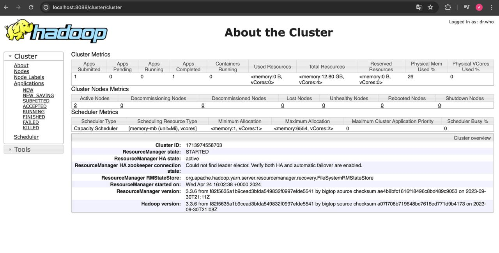

IMPORTANT ❗ ❗ ❗ Please remember to destroy all the resources after each work session. You can recreate infrastructure by creating new PR and merging it to master.
  


1. Authors:

   Grupa 10

   https://github.com/iotchenkoarist/tbd-workshop-1
   
2. Follow all steps in README.md.

3. Select your project and set budget alerts on 5%, 25%, 50%, 80% of 50$ (in cloud console -> billing -> budget & alerts -> create buget; unclick discounts and promotions&others while creating budget).

  

5. From avaialble Github Actions select and run destroy on main branch.


  
   
6. Create new git branch and:
    1. Modify tasks-phase1.md file.
    
    2. Create PR from this branch to **YOUR** master and merge it to make new release. 
    
      


7. Analyze terraform code. Play with terraform plan, terraform graph to investigate different modules.

    ***describe one selected module and put the output of terraform graph for this module here***
    
    Provider Node:

    The provider["registry.terraform.io/hashicorp/google"] is the Google Cloud provider used by Terraform to manage GCP resources.


    Resource Nodes:

    - google_dataproc_metastore_service.demo: Represents a Google Dataproc Metastore service resource to be managed by Terraform. It's shaped like a box, indicating it's a standard resource.
    - google_project_service.api-metastore: Represents enabling of the Metastore API service for the GCP project, also shaped like a box.

    Variable Nodes:

    - var.metastore_version, var.network, var.project_name, and var.region are variables that provide configurable parameters to Terraform resources. They are shaped like notes, indicating that they are input variables.

    Output Node:

    - output.metastore_name: An output that will display the metastore service's name after the resources are applied.

    Edges (Dependencies):

    - An edge from google_dataproc_metastore_service.demo to google_project_service.api-metastore indicates that the Dataproc Metastore service resource depends on the Metastore API service being enabled.
    Edges from google_dataproc_metastore_service.demo to the variable nodes (var.metastore_version, var.network, and var.region) indicate that the creation of this resource depends on these variables.
    - An edge from google_project_service.api-metastore to provider["registry.terraform.io/hashicorp/google"] indicates that enabling the API service depends on the Google provider.
    - An edge from google_project_service.api-metastore to var.project_name shows a dependency on the project name variable for the API service configuration.
    - The output node output.metastore_name depends on the successful creation of google_dataproc_metastore_service.demo.
    - The provider has a lifecycle edge (close) to google_dataproc_metastore_service.demo, indicating a point in the graph where resources managed by the provider may be created or destroyed.

    Root Node:

    - The root node represents the root module in Terraform, which is the entry point of the configuration. It has edges to the output node and the provider node, signaling that it orchestrates their creation and management.

8. Reach YARN UI
   
   Used command: ***gcloud compute ssh --zone "europe-west1-d" "tbd-cluster-m" --tunnel-through-iap --project "tbd-2024l-308908" -- -L 8088:localhost:8088   ***

      

9. Draw an architecture diagram (e.g. in draw.io) that includes:
    1. VPC topology with service assignment to subnets
    
    2. Description of the components of service accounts
       * tbd-2024l-308908-lab@tbd-2024l-308908.iam.gserviceaccount.com (tbd-terraform) - handles Terraform-related
       activities, allows infrastructure management of Google Cloud project from terraform level
       * tbd-2024l-308908-data@tbd-2024l-308908.iam.gserviceaccount.com (tbd-composer-sa) - manages the
       Cloud Composer environment, including the orchestration of Dataproc clusters and various jobs within
       that environment
       * 973102651483-compute@developer.gserviceaccount.com (iac) - mediator between GitHub and
       Google Cloud services, manages distribution of access tokens
    3. List of buckets for disposal
       * tbd-2024l-308908-code - Apache Spark job file
       * tbd-2024l-308908-conf - Notebook post startup script file
       * tbd-2024l-308908-data - Files with data from data-pipelines
       * tbd-2024l-308908-state - Terraform state files
    4. Description of network communication (ports, why it is necessary to specify the host for the driver) of Apache Spark running from Vertex AI Workbech
       * 10.10.10.2: tbd-cluster-w-1 - Worker
       * 10.10.10.3: tbd-cluster-w-0 - Worker
       * 10.10.10.4: tbd-cluster-m - Master
       * 10.10.10.5: tbd-2024-308908-notebook - JupyterLab Notebook VM

       In the context of Vertex AI Workbench, the Spark driver may run on a different machine or container than the Spark cluster itself.
       By specifying the host for the driver, we ensure that the Spark driver knows where to send tasks for execution and where to collect results from the Spark cluster.
       This information is crucial for establishing communication channels between the driver and the cluster, enabling efficient data processing and computation.
       * driver port: 30000
       * block manager: 30001

10. Create a new PR and add costs by entering the expected consumption into Infracost
For all the resources of type: `google_artifact_registry`, `google_storage_bucket`, `google_service_networking_connection`
create a sample usage profiles and add it to the Infracost task in CI/CD pipeline. Usage file [example](https://github.com/infracost/infracost/blob/master/infracost-usage-example.yml) 

   ***place the expected consumption you entered here***
   ```yaml
    version: 0.1
    resource_usage:
      google_artifact_registry_repository:
        storage_gb: 200 # Total data stored in the repository in GB
        monthly_egress_data_transfer_gb: # Monthly data delivered from the artifact registry repository in GB. You can specify any number of Google Cloud regions below, replacing - for _ e.g.:
          europe_west1: 100 # GB of data delivered from the artifact registry to europe-north1.
      google_storage_bucket:
        storage_gb: 50                    # Total size of bucket in GB.
        monthly_class_a_operations: 1000  # Monthly number of class A operations (object adds, bucket/object list).
        monthly_class_b_operations: 1000  # Monthly number of class B operations (object gets, retrieve bucket/object metadata).
        monthly_data_retrieval_gb: 50     # Monthly amount of data retrieved in GB.
        monthly_egress_data_transfer_gb:  # Monthly data transfer from Cloud Storage to the following, in GB:
          same_continent: 50   # Same continent.
          worldwide:     0     # Worldwide excluding Asia, Australia.
          asia: 0              # Asia excluding China, but including Hong Kong.
          china: 0             # China excluding Hong Kong.
          australia: 0         # Australia.
      google_service_networking_connection:
        monthly_egress_data_transfer_gb: # Monthly VM-VM data transfer from VPN gateway to the following, in GB:
          same_region: 50                 # VMs in the same Google Cloud region.
          us_or_canada: 0                 # From a Google Cloud region in the US or Canada to another Google Cloud region in the US or Canada.
          europe: 0                       # Between Google Cloud regions within Europe.
          asia: 0                         # Between Google Cloud regions within Asia.
          south_america: 0                # Between Google Cloud regions within South America.
          oceania: 0                      # Indonesia and Oceania to/from any Google Cloud region.
          worldwide: 0                    # to a Google Cloud region on another continent.
   ```

   ***place the screenshot from infracost output here***
    

11. Create a BigQuery dataset and an external table using SQL
    
    ***place the code and output here***
    
   
    The query we executed was based on an example provided in the README. Prior to running the query, it was essential to carry out step 13, as this step involved uploading data to a bucket which the query subsequently accessed.
    
    ***why does ORC not require a table schema?***

    ORC files don't require a predefined schema because they use a schema-on-read approach, where the data schema is interpreted at read time. ORC files contain a header with metadata about the column schema, allowing the data to be read and understood dynamically. This design provides flexibility for big data systems such as Hadoop
    
12. Start an interactive session from Vertex AI workbench:

    
   
13. Find and correct the error in spark-job.py
    Command used: ***gcloud dataproc jobs submit pyspark gs://tbd-2024l-308908-code/spark-job.py --cluster=tbd-cluster --region=europe-west1 --project "tbd-2024l-308908"***
    Logs output:
    
    Error:
    {
      "code" : 404,
      "errors" : [ {
        "domain" : "global",
        "message" : "The specified bucket does not exist.",
        "reason" : "notFound"
    } ]}

    ***Fix: Change DATA_BUCKET to DATA_BUCKET = "gs://tbd-2024l-308908-data/data/shakespeare/"***
    
    Succesfull output:
    
    

14. Additional tasks using Terraform:

    1. Add support for arbitrary machine types and worker nodes for a Dataproc cluster and JupyterLab instance

    ***place the link to the modified file and inserted terraform code***
    
    3. Add support for preemptible/spot instances in a Dataproc cluster

    ***place the link to the modified file and inserted terraform code***
    
    3. Perform additional hardening of Jupyterlab environment, i.e. disable sudo access and enable secure boot
    
    ***place the link to the modified file and inserted terraform code***

    4. (Optional) Get access to Apache Spark WebUI

    ***place the link to the modified file and inserted terraform code***
